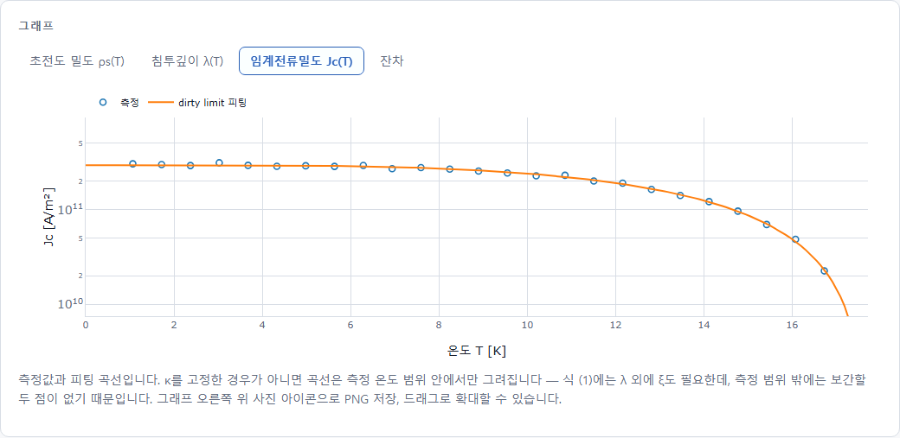

# Building a superconducting gap extractor from nothing

An experimental physicist who had never programmed, working with an AI coding
agent, building a web application by **spec-driven development**. What was
installed, in what order the work proceeded, and what came out at the end.
Written so that someone starting from the same place can follow it.

| | |
| --- | --- |
| Written | 2026-08-25 |
| For | a reader with no programming background |
| Elapsed | four days (2026-08-22 to 08-25) |
| Commits | 17 |

> The Korean version is [`manual.ko.md`](manual.ko.md). The two carry the same
> content; constitution VIII permits the Korean one under `docs/` alone.

---

## Contents

- [00. About this document](#00-about-this-document)
- [01. The whole map](#01-the-whole-map)
- [02. Prerequisites — what to install and why](#02-prerequisites--what-to-install-and-why)
- [03. Orca and Claude Code](#03-orca-and-claude-code--which-is-which)
- [04. SDD — spec-driven development](#04-sdd--spec-driven-development)
- [05. Phase 0 to 11 — what actually happened](#05-phase-0-to-11--what-actually-happened)
- [06. What one turn looks like](#06-what-one-turn-looks-like)
- [07. The result](#07-the-result)
- [08. Doing it again — a checklist](#08-doing-it-again--a-checklist)
- [09. What it taught, and the traps](#09-what-it-taught-and-the-traps)
- [Appendix A. Glossary](#appendix-a-glossary)
- [Appendix B. Commands worth keeping](#appendix-b-commands-worth-keeping)

---

## 00. About this document

Over 22 and 23 August 2026, a web application was built that extracts
the London penetration depth `lambda(0)` and the superconducting energy gap
`Delta(0)` from the self-field critical current density `Jc(T)` of a thin film.

That application is one result. This document is about the other one: **the
method**. Everything from the list of programs to install to a screenshot of
the finished page is here, so that the process can be repeated rather than
remembered.

### What the program does, in one line

Superconductivity research has an **asymmetry in measurement cost**. `Jc` and
the upper critical field `Hc2` come out of an ordinary four-probe transport
measurement in a day. Measuring the penetration depth `lambda` needs muon spin
rotation or a tunnel-diode oscillator; measuring the gap `Delta` needs
tunnelling spectroscopy or ARPES. Thin-film theory connects the two, so the
cheap measurement can be turned into the expensive quantities.

```
  Jc(T)  --invert eq. (4)-->  lambda(T)  --definition-->  rho_s(T)  --fit-->  Delta(0)
 four-probe transport         penetration depth          superfluid density   the gap
```

Based on E. F. Talantsev and J. L. Tallon, *Universal self-field critical
current for thin-film superconductors*, **Nature Communications 6**, 7820
(2015), equation (4).

### How to read it

- Text inside a code block is **typed into a terminal as written**. Lines
  starting with `#` are commentary and are not typed.
- `Text like this` is a filename, a folder, a command, or a variable.
- Every command assumes **Windows 11 with PowerShell**. On macOS or Linux the
  path separator is `/` rather than `\`, and the virtual-environment activation
  path differs.
- **There are two PowerShells.** The Start menu's "Windows PowerShell" is 5.1;
  "PowerShell 7" is a separate, newer install. The commands here are written to
  work in both — syntax 5.1 rejects, such as `&&`, is avoided.

> **If you are here to follow along right now**
>
> The place the first person to reproduce this actually got stuck was the very
> beginning: the terminal was open, and it was not obvious how to start the
> conversation at all. For that answer alone, go to
> [section 3.4](#34-starting-the-first-session--from-an-empty-folder-to-a-conversation).
> If nothing is installed yet, [section 02](#02-prerequisites--what-to-install-and-why)
> comes first.

> **The honesty rule of this document**
>
> What was verified and what was not are kept apart. The Docker image, for
> example, **has never once been built** — Docker is not installed on this
> machine. Rather than hide that, Phase 7 records what was checked instead. A
> document that presents unverified things as verified causes an accident
> later, without exception.

---

## 01. The whole map

Before the detail, the shape. Three blocks.

| Stage | What happens | What you hold afterwards |
| --- | --- | --- |
| **Prepare** | Install six tools and connect an account | Typing `claude` in a terminal gets an answer |
| **Specify** | Write seven documents without writing a line of code | "What is being built and why" fixed in prose. Two physics errors were caught here |
| **Build** | Phases 1 to 10, each behind a gate | A program running in a browser with 201 tests passing |

> **Why this order**
>
> "Write some code and see whether it works" feels natural. What makes it
> particularly dangerous with an AI agent is that **the AI does not refuse an
> ambiguous instruction — it fills the gap plausibly.** Without a written
> statement of what is being built, each conversation produces a slightly
> different object, and nothing anywhere can say which one is right.
>
> Writing the specification first is a device for controlling the agent, and at
> the same time a device for **the author to inspect his own thinking**. In this
> project, Phase 0 — where no code existed — surfaced two physics problems: an
> inconsistency in the weak-coupling BCS constants, and a crossing of the clean
> and dirty superfluid-density curves.

---

## 02. Prerequisites — what to install and why

### 2.1 Why so many tools

A laboratory analogy makes this quick. One measurement needs a cryostat, a
current source, a nanovoltmeter, and an acquisition PC; it does not come in one
box. Software is the same.

| Tool | Role, as lab equipment | Version here |
| --- | --- | --- |
| Git | The lab notebook. Records every change so any of them can be undone | 2.55.0 |
| Python | The language the calculation runs in. The backend is Python | 3.12.10 |
| Node.js | The toolchain that builds the web page. Not a browser — the *factory* that assembles one | 24.19.0 |
| nvm-windows | Keeps several Node versions installed and switches between them | — |
| Claude Code | The AI coding agent. What actually writes the code and runs the tests | 2.1.241 |
| Orca | A desktop application for running several agents at once | installed |
| Docker Desktop | Packages the finished product so it runs identically elsewhere | **not installed** |

### 2.2 Installing them

#### 1. Git — version control

Think of Git as a program that photographs your files every time you save.
If something that worked yesterday is broken today, yesterday's state comes
back exactly, and what changed, when, and why is all still there. With an AI
agent this matters more than usual: when twenty files change at once, Git is
the only way to see what happened.

```powershell
# Download and run the installer from https://git-scm.com/download/win
# The default options are fine.

# Check: a version number means it worked
git --version

# Once, so commits carry a name
git config --global user.name  "ktkim"
git config --global user.email "kgtakee@gmail.com"
```

#### 2. Python — the calculation engine

The physics and the server are Python. The project requires 3.11 or newer;
this machine has 3.12.10.

```powershell
# Install from https://www.python.org/downloads/windows/
# IMPORTANT: tick "Add python.exe to PATH" on the first screen of the
#            installer. Miss it and the terminal cannot find python.

python --version
```

#### 3. nvm-windows and Node.js — the page factory

Node.js builds the React front end. Builds break across Node versions often
enough that installing through a version manager and pinning per project is
standard. This project pins `24.19.0` in `frontend/.nvmrc`.

```powershell
# nvm-setup.exe from
# https://github.com/coreybutler/nvm-windows/releases

nvm install 24.19.0
nvm use 24.19.0

node --version   # v24.19.0
npm --version    # 11.17.0
```

> **What npm is**
>
> The **package manager** that arrives with Node. It downloads code other
> people wrote (libraries) and attaches it to a project. `npm install` means
> "fetch everything this project declares that it needs", and the result is
> tens of thousands of files under `node_modules`. That folder is **not put
> into Git** — it can be rebuilt at any time.

#### 4. Claude Code — the AI coding agent

Not the same thing as asking an AI questions in a chat window. Claude Code
runs in a terminal and **reads files, edits them, runs commands, runs the
tests, and fixes what fails.** Essentially all of this project's code was
written by Claude Code; the human decided what was being built and judged the
results.

```powershell
# What this machine actually has: the official installer, from
# https://claude.com/claude-code . It lands in
# C:\Users\<name>\.local\bin\claude.exe

claude --version

# Then, from the project folder
cd C:\Users\kgtak\projects\nodeless-sc-gap
claude
```

> **The version number will not match this document**
>
> Claude Code updates itself. It was 2.1.241 when this was first written and
> 2.1.245 a few days later. A different number is not a sign of anything wrong.
>
> With Node installed, `npm install -g @anthropic-ai/claude-code` works too.
> **It is not what was used here**, though: checked, and the npm global folder
> holds no copy — only `.local\bin` does. Use one or the other. With both
> installed, which one runs depends on the order of `PATH`, and
> `(Get-Command claude).Source` is what says which it currently is.

What the first run looks like, and how to leave and resume, is in
[section 3.4](#34-starting-the-first-session--from-an-empty-folder-to-a-conversation).

#### 5. Orca — a window for managing several agents

Covered in [Section 03](#03-orca-and-claude-code--which-is-which). The short
answer is that **it is optional.** The whole project can be built with Claude
Code alone; Orca sits on top for convenience.

#### 6. Docker Desktop — the packaging tool (not installed here)

Docker puts a program and everything it needs — Python version, libraries,
configuration — in one box so it runs *identically* on another machine. It is
what removes "but it works on my computer".

> **Not verified**
>
> The project has a finished `Dockerfile` and `docker-compose.yml`, but
> **the image has never been built.** Installing Docker Desktop needs
> administrator rights, which were not available on this machine. With Docker
> installed, one line checks it:
>
> ```powershell
> docker compose up --build   # then http://localhost:8000
> ```

#### Optional

- **Visual Studio Code** — for looking at the code. Not required, since Claude
  Code handles the editing, but convenient for browsing the structure.
- **Obsidian** — a Markdown reader. The seven specification documents and this
  manual are all Markdown, and following the links between them is pleasant.

### 2.3 Where to put the project — this actually went wrong

> **Path rules**
>
> A project path must satisfy three conditions.
>
> - **No non-ASCII characters.** Some tools misread the encoding and fail to
>   find files.
> - **No spaces.** A space separates arguments on a command line, so a script
>   that forgot a pair of quotes misbehaves quietly.
> - **Outside OneDrive, Dropbox, and other syncing folders.** A sync client
>   holding a file open makes builds fail intermittently, and the cause is very
>   hard to find.
>
> This project began at
> `C:\Users\kgtak\OneDrive\바탕 화면\개인 폴더\Program\Nodeless SC_Jc cal`,
> breaking all three. It was moved to
> `C:\Users\kgtak\projects\nodeless-sc-gap`.

Two things to know when moving:

- **Do not copy `.venv` or `node_modules` — rebuild them.** Both have absolute
  paths baked in and break when moved.
- **Leaving OneDrive ends automatic backup.** The replacement is a Git remote
  such as GitHub. This project has not set one up yet.

```powershell
# Rebuilding the environment at a new location -- once
cd C:\Users\kgtak\projects\nodeless-sc-gap\backend
python -m venv .venv
.\.venv\Scripts\python.exe -m pip install -e ".[dev]"

cd ..\frontend
nvm use            # reads .nvmrc and switches to 24.19.0
npm install
npx playwright install chromium
```

> **What a virtual environment is**
>
> An isolated place to install Python libraries **inside this project folder
> only**, rather than for the whole computer. It stops project A, which wants
> numpy 1.26, from fighting project B, which wants 2.0.
> `backend\.venv\Scripts\python.exe` is that Python, and this project's
> commands call it by path.

---

## 03. Orca and Claude Code — which is which

### 3.1 Claude Code

An AI agent that runs in a terminal. It opens a conversation; instructions in
plain language cause it to read files, edit them, and run commands. Properties
worth knowing:

- **It knows the project folder.** The directory it starts in is the workspace,
  and it works on the files inside it.
- **It reads `CLAUDE.md` automatically.** A file of that name at the top of the
  project is loaded at the start of every new conversation, so the same
  explanations need not be repeated.
- **Conversations are saved.** `claude --resume`, or `/resume` inside a
  conversation, picks up an earlier one.
- **Long conversations are compacted.** There is a limit on how much can be
  held at once; past it, earlier turns are summarised. `/compact` does it on
  demand.

### 3.2 Orca

Orca is a desktop application for **running several agents — Claude Code, and
others such as Codex — side by side under a GUI.** It is installed on this
machine, and the following was established from the traces it left:

| What Orca installed | What it does |
| --- | --- |
| `~/.orca/agent-hooks/claude-hook.cmd` | A small script that reports the agent's state back to the Orca window |
| Eight hooks in `~/.claude/settings.json` | Registrations telling Claude Code to run that script *whenever something happens* — conversation start, before and after a tool call, response end, permission request |
| A statusline | A command that draws the current state at the bottom of the Claude Code screen |
| git worktrees | Several checkouts of one repository in separate folders, one branch per agent |

> **What a hook is**
>
> A registration that says "when this happens, run this command for me". Claude
> Code keeps a list of them in `~/.claude/settings.json` and runs the
> registered command at each moment — at the end of a response (`Stop`), before
> a tool is used (`PreToolUse`), and so on. Orca puts its own script in those
> slots to receive the agent's state live. **The harness runs these, not the
> model**, which is why "from now on, always do X" belongs in a hook rather
> than in the agent's memory.

### 3.3 Is Orca necessary — no

What Orca did here was convenience. The work was done by Claude Code, and
nothing in the resulting files depends on Orca. Following this manual without
it means opening a terminal and typing `claude`.

> **A side effect that actually bit — a leftover worktree**
>
> To give each agent an independent workspace, Orca creates **git worktrees**:
> a second checkout of the same repository in another folder, on another
> branch. In this project one had been left behind at
> `C:\Users\kgtak\nodeless-sc-gap\burbot`, frozen at the initial commit, and
> the `burbot` branch attached to it could not be deleted.
>
> ```powershell
> git worktree list           # workspaces currently checked out
> git worktree prune          # forget ones whose folder is gone
> git branch -d burbot        # only now can the branch go
> ```
>
> Check `git worktree list` and `git branch` occasionally and clear anything
> unfamiliar.

### 3.4 Starting the first session — from an empty folder to a conversation

> This section was added later, because **the first person to reproduce the
> method from this document got stuck exactly here.** Everything else in it
> covered what comes afterwards.

**First, the thing nobody says: no separate window opens.** Unlike a chat
application, **the terminal you are already typing in becomes the conversation.**
Type `claude`, wait a moment, and a prompt appears; talk to it in ordinary
prose. Not knowing this is enough to stop someone, waiting for a window that is
never going to appear.

#### Starting a folder from scratch

```powershell
mkdir C:\Users\kgtak\projects\my-new-project
cd C:\Users\kgtak\projects\my-new-project
git init
claude
```

The folder name has to obey the
[path rules of section 2.3](#23-where-to-put-the-project--this-actually-went-wrong):
**no non-ASCII characters, no spaces, outside OneDrive.** That is why the
example is lowercase ASCII with hyphens.

#### Starting in a folder that already has files

Starting where some code or a draft document already sits is the more common
case. Here, **freeze the current state before typing `claude`.**

```powershell
cd C:\Users\kgtak\projects\my-new-project
git init
git add -A
git commit -m "Existing files before the rebuild begins"
claude
```

After the third line this exact state can be returned to at any point.
Without it, there is nowhere to go back to when the agent changes twenty files
at once.

> **Skipping `git init` also blocks Orca**
>
> Orca isolates each agent in a **git worktree** (section 3.2), and a worktree
> can only be made inside a git repository — so a plain folder is not something
> Orca will take. Whether or not Orca is used, `git init` comes first.

#### What the first run looks like

1. **Once only**, a browser opens to sign in to an Anthropic account. A Claude
   Pro/Max subscription or API credit is required.
2. A prompt appears in the terminal. Talk to it.
3. A good opening line is the
   [constitution prompt from step 1 of section 08](#step-1--the-constitution).

#### Leaving, and coming back

| To | Do |
| --- | --- |
| End the conversation | `/exit`, or Ctrl+C twice |
| Continue later | `claude --continue` (the last one), `claude --resume` (pick one) |
| Run a shell command yourself | `!` then the command at the prompt — e.g. `!git status` |

The last one earns its place: a command only a human can answer, such as an
interactive login, runs right there and its output lands in the conversation.

---

## 04. SDD — spec-driven development

### 4.1 What problem it solves

Spec-driven development means **writing the documents before the code and
making the code follow them.** In the language of a paper: rather than doing
the experiment and then writing it up, you fix in prose what will be measured
and why, and then measure that.

Three reasons it suits working with an AI agent.

1. **An AI fills ambiguity rather than flagging it.** Told "fit it", it decides
   for itself which residual to use. Written in the specification, there is no
   room for that.
2. **Conversations vanish; documents remain.** A new conversation remembers
   nothing of yesterday. The documents are the memory.
3. **A criterion appears.** "Is it done?" has a mechanical answer once thirty
   numbered requirements each map to a task and a test.

### 4.2 Five documents, five questions

| File | The question it answers | What it must never do |
| --- | --- | --- |
| `constitution.md` | Which rules does this project never break? | Be broken quietly for convenience. Changing one means amending the document first |
| `spec.md` | What is being built, and why? | **Name a technology.** Python, React, and JSON do not appear once |
| `research.md` | What is the basis for each equation, constant, and numerical method? | Be re-derived in the code. It is all here |
| `plan.md` | With what technology, and how? | Decide afresh what is being built |
| `tasks.md` | In what order, concretely? | List tasks with no gate |

This project has two more: `data-model.md` (data structures and the catalogue
of error codes) and `contracts/openapi.yaml` (the agreed format between the
page and the server). Seven documents under `specs/001-jc-to-gap/`.

### 4.3 The constitution — nine rules actually enforced

Exactly what the name suggests: the things it would later be convenient to
break, nailed down in advance.

| Art. | Rule | Why |
| --- | --- | --- |
| I | The physics code (`core/`) imports no web framework | Frameworks change every few years; the Talantsev–Tallon relation does not. **Enforced by a test** |
| II | No function computing a physical quantity without a test against a known answer | A wrong fit does not crash. It returns a *plausible number* |
| III | Specification precedes implementation. If the spec is wrong, the spec is corrected first | If implementation leads, the document becomes a lie at that moment |
| IV | The backend never returns a sentence for a human. Failures are codes | Keeps Korean out of English source, and keeps error handling testable. **Enforced by a test** |
| V | SI everywhere inside the core. A variable holding a non-SI value carries the unit in its name | Unit confusion is the first cause of silent error in physics code |
| VI | A result travels with the assumptions it rests on and any detected violation | The equation returns a number for input that breaks every assumption |
| VII | A stochastic computation takes a seed and reports the one it used | An error bar that changes between runs cannot be cited |
| VIII | English for code, documents, and commits; Korean on screen | Amended in 1.1.0: teaching material under `docs/` is exempt — this manual's Korean twin relies on that |
| IX | Simplicity is the default; complexity needs a written justification in `plan.md` | The maintainer is a researcher, not a full-time engineer |

> **What "enforced by a test" means**
>
> Articles I and IV are not only prose. `tests/test_core_purity.py` parses the
> imports of every module under `core/` and fails the build if a web framework
> appears. `tests/test_api.py` fails if any response body contains a
> non-ASCII character — that is, Korean. **A rule you cannot avoid keeping is
> the only kind that is really a rule.**

### 4.4 The rule against naming technology in the spec

`spec.md` never uses the words "Python", "React", "CSV", or "button". It says
things like *"the user must be able to supply a table of temperature and
critical current density"* and *"results must be able to leave the machine"*.

The reason is that the document should still be true in two years. React can be
replaced and "what we were trying to build" survives. Technology choices live
entirely in `plan.md`.

### 4.5 Gates

Each phase in `tasks.md` ends with a **gate**: a line saying that until this
condition holds, the next phase does not begin. Phase 1's was *"`pytest` green,
`T118` in particular"* — the round trip.

Without gates, "it seems to work, let us move on" repeats until nobody can find
where it went wrong.

### 4.6 spec-kit — the tool we did not use

> **Stated plainly**
>
> GitHub publishes a tool called **spec-kit** whose `specify init` generates
> this folder layout and a set of slash commands (`/speckit.specify` and so
> on). The `.specify/` and `specs/001-jc-to-gap/` structure here follows that
> tool's *shape*, but **the tool was never installed.** The evidence:
> `.specify/` contains only `memory/constitution.md`, and the
> `scripts/`, `templates/`, and `.claude/commands/` that spec-kit creates are
> absent.
>
> The seven documents were written in conversation. The tool makes it easier;
> it is not required. **SDD is an order of work, not a tool.**

---

## 05. Phase 0 to 11 — what actually happened

What follows is the record. Ten commits correspond to the stages. The **what
actually happened** paragraphs are the most valuable part of this manual: the
places where things did not go to plan are the places with something to learn.

### Phase 0-a — the repository and the constitution · `356e8a9`

- **Done** — `git init`, `.gitignore` and `.gitattributes`, the nine articles,
  and the three existing command-line scripts archived into `legacy/`
- **Code** — none

The three prototype scripts were archived rather than deleted. **Their code is
not inherited, but their numbers are.** `test_legacy_agreement.py` later runs
the old scripts for real and checks that the new code reproduces their
`lambda(T)` to 1e-9 relative. The old code serves as an answer key while the
structure is written afresh.

### Phase 0-b — seven documents, physics fixed before code · `724cdc6`

- **Done** — `spec.md` (30 requirements, 10 acceptance scenarios),
  `research.md`, `data-model.md`, `plan.md`, `contracts/openapi.yaml`,
  `quickstart.md`, `tasks.md`
- **Gate** — every one of the 30 requirements reachable from at least one task

> **Two physics errors caught with no code**
>
> - **The weak-coupling BCS constants disagreed with each other.** 3.5279
>   against 2 x 1.7639, which should be the same number. Corrected to
>   `2 pi / e^gamma = 3.52775` and `1.763875`.
> - **The clean and dirty superfluid densities cross below `T/Tc = 0.25`.**
>   Traced to the residual error of the `tanh` gap interpolation, not to the
>   models. Knowing this in advance meant a test asserting the ordering there
>   was *never written in the first place*.

One more finding: whether a stated 5 % uncertainty on `Jc` is a **calibration
error** common to the dataset or **point-to-point scatter** changes the
uncertainty on `Delta(0)` from zero to several per cent — in fixed-`kappa`
mode a common multiplicative factor cancels exactly, because `rho_s` is a
ratio. That discovery *added* requirements FR-029 and FR-030. Writing the
specification changed the design.

### Phase 1 — the physics core, settled before any web · `c506fe0`

- **Done** — eleven modules under `backend/app/core/`, plus tests. No web
  framework appears yet
- **Gate** — `pytest` green, the **round trip** in particular —
  139 tests passed

> **The round trip — the most important test in the project**
>
> Synthetic `Jc(T)` is generated from values that are *known*:
> `lambda0 = 200 nm`, `Delta0 = 1.5 meV`, `Tc = 10 K`, `kappa = 40`. That data
> goes into the program, and the three original values must come back out.
> They do, to better than 1e-9 relative.
>
> This is decisive because **a factor of two, a flipped sign, or a missing unit
> conversion does not crash anything. It returns a plausible number.** No
> amount of reading, reviewing, or type-checking catches those. Only a round
> trip through a known answer does.

#### Four decisions that measurement reversed

Four times in this phase the specification turned out to be wrong. In all four
cases **the specification was corrected first, with the numbers recorded in
`research.md`**, and only then the code.

| Item | What the spec said | What measurement showed |
| --- | --- | --- |
| Quadrature | Adaptive | Projected to **8 hours** for one Monte Carlo run. A fixed 80-node Gauss–Legendre rule over four panels agrees to **4.4e-16** and is **250x** faster — three minutes |
| Residual | Superfluid density | Recovers the parameters, but is heteroscedastic, so the covariance formula reported the standard error on `Tc` wrong by a **factor of two**. Over 400 bootstrap replicas a **log-lambda** residual is honest to 7 %, with five times less bias |
| Model comparison | A 20 % margin on chi-squared | Ignores sample size, so collecting more data did not improve the verdict. `Delta_AIC >= 10` improves monotonically: 11 % to 59 % declared correctly going from 20 to 160 points |
| Solver branch | — | Searching `lambda > xi` **can only return kappa > 1**. No root is a statement about the data rather than a solver failure, so the error code was redefined |

### Phase 2 — an HTTP layer over the physics · `8938a63` `32605a3`

- **Done** — nine FastAPI endpoints, Pydantic validation, Monte Carlo as a
  background job
- **Gate** — every endpoint exercised by hand at
  `http://localhost:8000/docs` — 166 tests passed

> **What an endpoint and an API are**
>
> A web program splits into a "page" and a "calculation server". The counter at
> which the page asks the server *"analyse this data"* is an **endpoint**, and
> the counters together are the **API**. This project's are `/api/parse` (read
> a table), `/api/lambda`, `/api/analyze`, `/api/uncertainty`, and others.
>
> From that list of counters, FastAPI **generates `/docs`, a test page, by
> itself.** Every endpoint can be called from a browser before a single line of
> front end exists — which is why Phase 3 could be built against a working
> server rather than against a guess.

The table mapping error codes to HTTP statuses lives in `main.py` and nowhere
else. Attaching it to the exception classes would give the physics an opinion
about HTTP, which is article I.

The second commit (`32605a3`) changes no code — it **corrects the contract**.
The model-comparison criterion had moved from chi-squared to AIC during Phase
1, and `openapi.yaml` still described the old rule. Article III: the document
goes first.

### Phase 3 — the React page, with types generated from the server · `33b4a6c`

- **Done** — Vite, React and TypeScript; eight components; the Korean strings
- **Gate** — one example running from input to result in a browser

> **Why "generating the types" matters**
>
> The page's code has to know what the server returns. Usually somebody writes
> that down by hand, and when the server changes, that note becomes a quiet
> lie.
>
> Here, `npm run gen:api` **reads the format from the running server and
> generates the TypeScript.** When the server changes, the page fails to
> *compile*. A quiet lie becomes a loud error — which is the entire reason
> TypeScript is in this project.

> **A design defect caught on the first build**
>
> Compiling against the generated types failed immediately: `root_xtol` and
> `root_rtol` were missing, as **required** fields. They are termination
> conditions for the Brent root finder. Specified as part of the analysis
> settings, they had obliged every client to send two numbers it has no basis
> for choosing and no benefit from changing — the numerical error they control
> is orders of magnitude below any experimental uncertainty. They became
> core-only, with the reason recorded. **A compiler found in one minute a
> design defect a user would have found later.**

Korean prose lives in exactly one source file, `frontend/src/errorMessages.ts`.
Every error and warning code maps to a sentence saying what happened, where,
and what to do about it. An unrecognised code renders visibly rather than
silently, so a missing translation cannot hide.

### Interlude — Playwright, and looking at the page · `dbc3306`

Playwright **drives a browser automatically**. "Click the example button, run
the analysis, check that `lambda(0)` appears in the results table" is repeated
without a human. Eight of the ten acceptance scenarios written out in
`quickstart.md` became checks that are *executed*.

> **What being able to see the page found — and unit tests could not**
>
> - **A stale dataset could be analysed.** For a brief moment after pasting new
>   data, the analyse button still pointed at the *previous* dataset. The
>   screenshot run had been quietly capturing the wrong example.
> - **An unreachable backend showed as nothing.** The example list swallowed
>   its own failure, so a dead server looked exactly like a build with no
>   examples.
> - **Korean broke mid-word.** Fixed with CSS `word-break: keep-all`.
> - **Narrow windows crushed the tables.** At 420 px, "meV" stacked as three
>   lines of one letter.
>
> All four existed while 166 backend tests passed. **Some defects are only
> visible by looking.**

### Phase 4 to 6 — plots, uncertainty, diagnostics · `8d46d44`

- **Phase 4** — three plots (superfluid density, penetration depth, residuals),
  PNG export, CSV download
- **Phase 5** — Monte Carlo propagation as a *background job*, with a progress
  bar and the page still usable
- **Phase 6** — the diagnostics panel: chi-squared, coupling regime, clean
  versus dirty, and violated assumptions
- **Gate** — 166 backend plus 23 end-to-end tests

**Why there is a residual plot.** A small chi-squared is perfectly compatible
with a systematic departure that is obvious the moment the curve is drawn. Some
things a single number cannot show, so the third tab is residuals.

> **The constitution doing its job**
>
> Drawing the measured points on a superfluid-density plot needs
> `lambda0^2 / lambda^2`. One division in the page's TypeScript would do it.
> But then a physical definition would exist in two places. Under article I the
> value was moved so that **the backend computes it and sends it in the
> result.** "Do not compute a physical quantity in TypeScript, even a one-line
> one" is still written in `CLAUDE.md`.

The correlation mode (`SYSTEMATIC` or `INDEPENDENT`) is not merely offered but
explained, because the same stated "5 % on Jc" gives an uncertainty on
`Delta(0)` of zero or of several per cent depending on which kind of error it
is.

### Phase 7 — containerisation and a README · `cbca67f`

- **Done** — a multi-stage `Dockerfile` (Node builds the page, Python serves
  it), `docker-compose.yml`, a health check, and the root `README.md`
- **Gate** — **partly met, and recorded as such**

> **What a multi-stage build is**
>
> Stage one builds the page with Node; the output is a handful of static files.
> But the `node_modules` used to build them is hundreds of megabytes. A
> multi-stage build **passes only stage one's output to stage two and discards
> the rest.** The final image holds a Python runtime and the finished page.

> **What was not verified — plainly**
>
> Without Docker the image was never built. Everything checkable without a
> daemon was checked.
>
> - Stage one's exact build command runs and produces the asset bundle
> - The dependency layer installs from `pyproject.toml` alone
> - The `/app` layout the image would create was reproduced in a clean virtual
>   environment and the image's own start command run against it: the page is
>   served with the asset hash stage one produced, `/api/*` and `/docs` answer,
>   the health check exits 0, and a full analysis returns
>   `lambda(0) = 250.042 nm` and `Delta(0) = 1.4003 meV`
> - `backend/tests/` is absent from the layout
>
> **What remains is the daemon's part alone** — that the base images resolve
> and that compose starts.
>
> That check had to be done twice. The first attempt *appeared to pass while
> actually talking to the development server.* The asset hash not matching the
> one just produced is what gave it away. That is the difference between
> "verified" and "thought it was verified".

### Closing — CLAUDE.md, for the next conversation · `2d2ae5e`

The conversation that built this does not carry into the next session. The
repository was written so it does not need to — constitution, spec, research,
tasks, and the commit messages carry the reasoning — but a new session still
has to be told where to look and in what order. That is `CLAUDE.md`.

The important part is the list of **five things that look like bugs and are
not.** Without it, the next session's agent "fixes" behaviour that was correct.
They are in [Section 09](#09-what-it-taught-and-the-traps).

### Phase 8 — exporting the fitted curve as numbers

Requested after Phase 7 closed. Replotting the orange curve in another program
needs numbers rather than an image, and the existing CSV did not contain them.

**Why more columns would not work.** The existing table is *one row per
measured point*. The curve is 200 points on a grid unrelated to the
measurements, so the row counts differ. A spreadsheet column cannot be
measurements at the top and model at the bottom. So a second file was added,
with the same explanatory header block in both — either file may be opened
without the other, and a curve whose conditions are unknown is not a result
(article VI).

**The curve now starts at `T = 0`.** It used to start at the coldest measured
point, so the intercept the analysis reports — `lambda(0)`, `Delta(0)` — was
not on the plot it came from. This was **measured before changing rather than
assumed**: both gap models return `rho_s` of exactly `1.0` at zero, so the
curve's first `lambda` is bit-for-bit the fitted `lambda(0)`. The tests
therefore assert **equality, not closeness** — `approx` would let a curve that
merely starts near zero pass.

**The exported curve is the plotted one, not a fresh sampling.** A file that
disagrees with the figure printed beside it is a defect that surfaces only in
someone else's paper. So the test compares it **value by value** with the curve
in the response, rather than checking its shape.

As a bonus, the residual and the measured `rho_s` are one value per measured
point, so they fit the existing rows and joined that table as two more columns.

- **Gate** — 169 backend plus 24 end-to-end tests. Screenshots retaken,
  because the plots changed.

### Phase 9 — a build for a machine that has no Python

Distribution, not a feature. Nothing about the analysis changes; the only new
thing is a way to start it where nothing is installed.

What comes out is one file, `NodelessSC.exe`, 54 MB. The recipient
double-clicks it — no Python, no Node, no administrator rights. **The size is
the explanation: Python itself, along with scipy and numpy, is inside it.**

```
scipy       109 MB  --+
numpy        31 MB    |  compressed into one 54 MB file
Python      ~25 MB    |
fastapi etc   5 MB  --+
```

**Knowing where its own files are was the problem.** `main.py` and
`examples_store.py` each computed the location of `static/` and `examples/`
from `__file__`. That is right when installed and wrong inside a bundle, which
unpacks itself into a temporary directory on every launch.
`app/resources.py` now makes that decision once for both.

**The port is asked for rather than chosen.** A fixed port such as 8000 is a
guess about somebody else's machine, and on many of them it is already taken.
The socket is bound first and handed to the server, so nothing can slip in
between choosing a port and listening on it.

> **Measurement changed the deliverable again**
>
> "One file" was the decision. Measured, it starts in **12.6 s** — 19.4 s on a
> cold first run — because it unpacks 54 MB into a temporary directory every
> time and shows nothing while it does. Shipped as a zipped folder instead it
> starts in **5.0 s**.
>
> Twelve seconds of no response reads as a broken program. Which is right
> depends on whether the recipient minds unzipping, not on anything technical,
> so the same build file produces **both**.

> **The first build was 11 MB, when scipy alone is 109**
>
> The size was the only symptom. PyInstaller runs its entry point as a
> top-level script, where `desktop.py`'s relative import has no parent package
> and fails — during analysis as well as at runtime, so everything that would
> have been pulled in behind that import, numpy and scipy included, went
> unbundled. `packaging/entry.py` exists only to make that import absolute.

- **Gate** — 171 backend tests, and the executable returns what the source
  build returns: `lambda(0) = 250.0422 nm`, `Delta(0) = 1.40030 meV`,
  `Tc = 9.2002 K`, `2 Delta(0)/kB Tc = 3.5325`.
- **Confirmed on another machine** (2026-08-26) — carried over and opened: the
  browser came up by itself, and the maintainer's **own measured data**, not a
  shipped example, gave the same result as the source build. Nothing had to be
  installed there. Whether that machine had Python was not asked, so the
  stronger claim is not made here.
- **What the trip found instead** — **antivirus software flags it.** It runs
  once allowed through, but a recipient who was not warned deletes the file. A
  one-file build unpacks 54 MB into a temporary directory at every launch and
  runs from there, which is the shape of a dropper and indistinguishable from
  one by inspection. A one-folder build unpacks nothing, so **one file against
  one folder is no longer a question about startup time**; it is a question
  about the scanner ([section 7.3.1](#731-giving-it-to-somebody-else)).

### Phase 10 — the Jc(T) the fit predicts

A feature added to a tool already in use. The two plots showed how well the fit
follows the *derived* quantities, and nothing compared it against Jc itself —
the one number the user actually supplied.

**This is where the symmetry breaks.** The superfluid density and penetration
depth curves need only the three fitted parameters, so they can be sampled at
any temperature from absolute zero up. Recovering Jc through equation (1) needs
the coherence length **as well as** the penetration depth.

| How xi is established | Is xi known at any temperature? |
| --- | --- |
| Fixed kappa | **Yes** — xi = lambda_model(T)/kappa, from the fit alone |
| From Hc2 | **No** — Bc2 exists only where it was measured |
| Supplied xi | **No** — same reason |

In two of the three there is no way to fill the space between measurements.
Filling it would mean assuming a form for Bc2(T), which section 9 of the
specification puts explicitly out of scope. So the prediction is computed at the
measured temperatures in all three modes — one branch instead of three, and no
assumption the analysis has not already stated. At the 22 and 25 points of the
shipped examples the polyline is indistinguishable from a curve. At five points
it would look angular, which is an honest thing for it to look like.

**That choice made the export easy.** One value per measurement means it fits
in the table that already has one row per measurement. No second file, unlike
the curve of Phase 8, and it sits beside the measured Jc, because plotting one
against the other is the reason the column exists.

> **The same quantity computed twice will eventually disagree**
>
> The direct route's residual is defined as `ln(Jc_data) - ln(Jc_model)`. The
> newly reported prediction is therefore **the same quantity that residual
> already measured**.
>
> So both now leave a single function, and the test asserts **exact equality**
> rather than approximate agreement. "Nearly equal" there would mean a second
> expression for one quantity had appeared somewhere, and two such expressions
> drift apart sooner or later.
>
> It cost something. Route A never looks at Jc while it is fitting and had no
> reason to hold a coherence length; it carries one now purely so the prediction
> exists for that route too. Computing it in `pipeline.py` after the fit would
> have touched less code and left that identity as a coincidence to be
> maintained by hand.

> **Nothing but looking at the picture would have caught it**
>
> The first screenshot of the new tab labelled the axis `10B`, which is how
> Plotly abbreviates ten to the tenth. A billion is a word with two meanings and
> this axis carries a unit, so the ticks are powers of ten instead. Every test
> passed while it was wrong.

- **Gate** — the prediction and the direct route's residual are one quantity,
  not two that agree. Met, and checked as equality rather than to a tolerance.
  176 backend plus 25 end-to-end tests.

---

### Phase 11 — the same Jc(T), drawn as a curve

This phase exists because the tool was used and the plot was wrong. Not wrong
in its numbers: wrong in what it looked like.

Phase 10 drew the prediction as a line joining the measured temperatures. The
report from use was that it does not read as a fit -- it reads as a second data
series. That reading was close to correct. The line combined the **fitted**
`lambda` with the **measured** `xi`, so every wiggle in the `Hc2` column
appeared in the line that was meant to be the model.

> **The mistake was in the argument, not in the code**
>
> Phase 10 refused to draw a curve because filling the space between the
> measurements needs `xi` there, and supplying it would mean assuming a form
> for `Bc2(T)` -- which section 9 of the specification excludes.
>
> That treats two different acts as one. Reaching *past* the last measurement
> really is assuming a form for `Bc2(T)`: nothing constrains the value, so the
> value is the assumption. Filling in *between* two measurements is not; the
> interpolant is pinned on both sides, and which one is used barely changes the
> answer.
>
> "Barely" was measured rather than asserted, because that is the rule here.

**What was measured, and what it changed.** The obvious way to fill the gaps is
to interpolate `xi` itself. It is the wrong quantity. From equation (2),
`xi` goes as `Bc2^(-1/2)`, which turns sharply upward as `Bc2` falls towards
zero near `Tc` -- exactly where measurements are usually sparsest. `Bc2` is
close to polynomial in `T`, and interpolating it and converting afterwards is
**thirty to a hundred times more accurate on the same points**.

| `Bc2(T)`, 8 points | interpolate `Bc2` | interpolate `xi` |
| --- | --- | --- |
| `1 - t^2`, the usual form | 0.027 % | 2.23 % |
| `1 - t` | 0.000 %, exact | 2.35 % |
| `(1 - t^2)^2` | 1.52 % | 6.36 % |

A second measurement settled which interpolant. A cubic spline is more accurate
than PCHIP on noiseless data and worse once the data carry 1 % scatter, where
it also adds about three times as much oscillation -- and an oscillation
between two points is a feature of the drawn curve that the model does not
have, which a reader cannot tell from one that does. PCHIP, therefore.

And a third measurement said that none of it matters much: a 1 % error in `xi`
moves the drawn `Jc` by 0.23 % at `kappa = 45`, because `xi` enters equation (1)
only inside a logarithm. That is the same insensitivity research R11 records
from the other direction. It is worth knowing, and it is not a reason to skip
the measurement -- "it does not matter much" is a conclusion, not an assumption.

**What had to be right or the page would have gone blank.** Outside the
measured range the curve has no value, and in the physics core that is `NaN`.
JSON has no `NaN`; Python's encoder writes the bare token `NaN`, which the
browser's `JSON.parse` rejects. One such gap would have taken down the entire
response, not just the one plot. The gaps are converted to `null` at the API
boundary, and a test reads the raw response text to check -- a parsed body
would have turned the token into a float before the test could see it.

The same distinction runs into the exported file: the cell is left **blank**,
never `0` and never `nan`. A spreadsheet reads a blank as missing and a number
as a measurement, and a zero at a temperature the analysis declined to speak
about would end up in someone's figure.

- **Gate** — the `Jc` tab shows a fitted curve, and the curve and the reported
  per-point column are one model rather than two. **Met**: a test evaluates the
  curve's own recipe at the measured temperatures and gets the reported column
  back. 191 backend plus 25 end-to-end tests.

---

## 06. What one turn looks like

### 6.1 Division of labour

| The human | The agent |
| --- | --- |
| Decides what is being built and why | Proposes with what technology and how |
| Judges whether the physics is right | Turns the physics into code and pins it with tests |
| Decides whether a gate passed and whether to move on | Runs the gate condition and reports the numbers |
| Looks at the page and says what is wrong with it | Writes the code, runs the tests, writes the commit message |

### 6.2 The shape of a turn

The pattern that actually repeated in this project.

1. **Concept first.** Whatever the step introduces — what `pytest` is, what a
   container is — explained without assuming programming knowledge.
2. **Document first.** If something must change, `research.md` or `spec.md`
   changes before the code.
3. **Code.** The agent writes and edits.
4. **Tests.** The agent runs `pytest` and reports the numbers.
5. **Check.** The human gets a command to run and looks at the result.
6. **Commit.** Saved with a long message saying what was done and why.

### 6.3 Good and bad instructions

**What does not work**

> "Write me a program that gets the superconducting gap."

The agent decides the model, the fitting method, the residual, the units, and
the layout. Ask again in another conversation and a different answer arrives.

**What works**

> "Implement the clean-limit integral from R4 of
> `specs/001-jc-to-gap/research.md` in `core/gap_models.py`. For tests, check
> the two limits `rho_s(T->0) = 1` and `rho_s(T->Tc) = 0` first, then move on to
> the round trip. Before implementing, explain the concepts this step
> introduces."

The basis (a document), the location (a file), the criterion (tests), and the
order are all fixed.

### 6.4 Memory, when conversations get long

| Device | What it does |
| --- | --- |
| `CLAUDE.md` | At the top of the project, **every new conversation reads it automatically.** Anything you would otherwise repeat goes here |
| `/compact` | Summarises the earlier part of a long conversation. Also happens automatically |
| `/resume` | Continues a previous conversation |
| Memory | Stores facts that outlive one project — "this person is an experimental physicist" — as files |
| Commit messages | **The sturdiest memory of all.** This project's are deliberately long: why a thing was done, what was measured, and what was not verified |

> **Why commit messages are long here**
>
> Code shows *what* it does and cannot show *why*. "A fixed 80-node
> Gauss–Legendre rule instead of adaptive quadrature" is visible in the code;
> "the former projects to eight hours per Monte Carlo run, and the latter
> agrees to 4.4e-16 while being 250 times faster" exists only in the commit
> message. That paragraph is the only thing standing between the decision and
> somebody undoing it next year for looking overcomplicated.

---

## 07. The result

### 7.1 In numbers

| | |
| --- | --- |
| Commits | 17 |
| Backend tests | 191 |
| Browser tests | 25 |
| API endpoints | 10 |
| Requirements | 30, each mapped to a task |
| Built-in examples | 2 |

### 7.2 Where everything lives

```
nodeless-sc-gap/
├── CLAUDE.md                 read automatically by every new agent session
├── README.md                 the introduction, for a person
├── dev.ps1                   starts both servers at once
├── Dockerfile                the packaging plan (never built)
├── docker-compose.yml
│
├── .specify/memory/
│   └── constitution.md       the nine rules
│
├── docs/                     teaching material (article VIII exemption)
│   ├── manual.en.md          this document
│   ├── manual.ko.md          the Korean version
│   └── images/               ten screenshots for the manual
│
├── specs/001-jc-to-gap/      the specification -- written before the code
│   ├── spec.md               what and why (no technology named)
│   ├── research.md           every equation, constant, and numerical method
│   ├── plan.md               with what technology
│   ├── data-model.md         data structures and the error-code catalogue
│   ├── contracts/openapi.yaml  the page/server contract
│   ├── quickstart.md         how to run it, and ten acceptance scenarios
│   └── tasks.md              the task list and its gates
│
├── backend/
│   ├── app/
│   │   ├── core/             the physics. No web framework, ever
│   │   │   ├── lambda_solver.py    inverting equation (4)
│   │   │   ├── gap_models.py       Delta(T), rho_s(T), clean and dirty
│   │   │   ├── fitting.py          least squares, route A and route B
│   │   │   ├── montecarlo.py       uncertainty propagation
│   │   │   ├── diagnostics.py      warnings about violated assumptions
│   │   │   └── ... (eleven modules)
│   │   ├── main.py           the app, and the error-code to HTTP-status table
│   │   ├── api/routes.py     ten endpoints
│   │   ├── schemas.py        the wire format. Units convert only here
│   │   ├── resources.py      where its own files are: installed or packaged
│   │   └── desktop.py        entry point for the standalone build
│   ├── tests/                15 files, 191 tests
│   └── examples/             two built-in examples and their generator
│
├── packaging/                building the distributable .exe
│   ├── build.ps1             the build command
│   ├── NodelessSC.spec       what goes into the bundle
│   └── entry.py              the packager's entry script
│
├── frontend/
│   ├── src/
│   │   ├── App.tsx           the flow through the page
│   │   ├── components/       input, settings, tables, plots, diagnostics
│   │   ├── api/generated.ts  generated from the server. Never hand-edited
│   │   └── errorMessages.ts  the Korean the screen shows
│   └── e2e/                  browser tests and screenshots
│
└── legacy/                   the three archived scripts, kept as an answer key
```

### 7.3 Three ways to run it

```powershell
# 1. The easy one -- starts both servers and opens the browser
cd C:\Users\kgtak\projects\nodeless-sc-gap
.\dev.ps1
#   -> http://127.0.0.1:5173       the page
#   -> http://127.0.0.1:8000/docs  the API test page
#   Ctrl+C stops both

# 2. By hand, in two terminals
cd backend
.\.venv\Scripts\python.exe -m uvicorn app.main:app --reload --port 8000
# (in the other terminal)
cd frontend
npm run dev

# 3. In a container, if Docker is installed (never verified here)
docker compose up --build
#   -> http://localhost:8000  page and API on one port
```

### 7.3.1 Giving it to somebody else

Builds a file that needs nothing installed on the receiving machine.

```powershell
.\packaging\build.ps1            # one file,   packaging\dist\NodelessSC.exe
.\packaging\build.ps1 -OneDir    # one folder, packaging\dist\NodelessSC-windows.zip
```

| | Size | Startup | Antivirus | What the recipient does |
| --- | --- | --- | --- | --- |
| One file | 54 MB | 12.6 s | **Objects** | Double-click it |
| Zipped folder | 55 MB | 5.0 s | Quiet | Unzip, then double-click the `.exe` inside |

Double-clicking opens a console window, and a browser follows a moment later.
**Closing the console stops the program** — it is the only stop button the
recipient has, which is why it is not hidden.

> **Expect the antivirus warning, and warn the recipient first**
>
> The one-file build was flagged on the machine it was carried to. It ran once
> allowed through, but somebody who was not told to expect this deletes the
> file and reports that the program is broken.
>
> The scanner is not wrong to be suspicious. A one-file build unpacks 54 MB
> into a temporary directory at every launch and runs from there, which is
> exactly the shape of a dropper. Nothing about the file says which it is. UPX
> compression is already switched off in the build spec because it is another
> such signal.
>
> **The one-folder build does not unpack anything at startup, so it does not
> trip this.** That is now the better reason to prefer it — better than the
> 12.6 s against 5.0 s that the original measurement turned on. Send the zip.
>
> Removing the warning properly means signing the executable with a purchased
> certificate. That was not done, so this stays a thing to explain rather than
> a thing that is fixed.

> **How this differs from Docker**
>
> Docker also makes a program run identically elsewhere, but **the recipient
> has to install Docker first.** It is for putting software on a server, not
> for handing a colleague one file. The executable asks nothing of whoever
> receives it.

### 7.4 The screens


**The starting screen.** Data can be pasted or opened from a file, and with no
data at all the built-in examples `nbti_like` and `nb3sn_like` start the whole
thing. The settings panel below chooses the `Jc` unit, how the coherence length
`xi` is determined (from `Hc2`, entered directly, or a fixed `kappa`), the gap
model, and the extraction route. The grey text under each control explains *why
you would choose it* — most usefully under the unit selector, where it says
that getting the unit wrong moves the penetration depth by a factor of 21.5.


**Immediately after loading an example.** The column preview appears as soon as
the table is read, so that a human confirms the columns were interpreted
correctly *before* any physics runs.


**The result that matters.** Four quantities, each with its fit standard error.
The chips beneath give the coupling verdict, the model used, the route used,
the reduced chi-squared, and the degrees of freedom. The closing sentence turns
it into something a person can read: `2 Delta(0)/kB Tc = 3.5325` is 100.1 % of
the BCS weak-coupling value of 3.52775.


**The whole page once the analysis has run.** The per-temperature table of
`xi`, `lambda` and `kappa`, the fit summary, the plots, and the assumptions
follow one another down the page.


**Superfluid density `rho_s(T)`.** Where the gap is actually determined. The
orange curve **starts at `T = 0`** — `rho_s` is exactly 1 there and `lambda` is
exactly the fitted `lambda(0)`, so the reported intercept really is on the
plot. That curve can be downloaded as numbers with the second CSV button
(`nodeless_sc_curve.csv`), which is the file to use when replotting it in
Origin or Excel beside your own measurements.


**Critical current density `Jc(T)`.** What was supplied, with the fitted curve
drawn through it. The two plots above show *derived* quantities; this is the
only one that compares against the measurement itself. Both columns are in the
result CSV, side by side -- `Jc_A_per_m2` and `Jc_model_A_per_m2` -- and the
curve itself is the `Jc_model_A_per_m2` column of the curve CSV.

**The curve stops where the measurements do.** In the picture above it begins
at the coldest measured temperature and ends at the hottest, unlike the
`rho_s` and `lambda` curves which run from 0 K to `Tc`. Equation (1) needs `xi`
as well as `lambda`, and `xi` comes from the fit only in fixed-kappa mode.

| How `xi` is established | Where the curve is drawn |
| --- | --- |
| Fixed `kappa` | **0 K to `Tc`** -- `xi = lambda_model(T)/kappa`, from the fit alone |
| From `Hc2` | Between the coldest and hottest measurement |
| Explicit `xi` | Between the coldest and hottest measurement |



The second example, `nb3sn_like`, which fixes `kappa`. Same tab, but the curve
starts at absolute zero and leaves the frame at the bottom right. **Fixing
`kappa` lets the curve be drawn everywhere because it assumed the number it
needed**, and this figure is the one place that difference is visible.

> **Interpolating between the points and reaching past them are not the same act**
>
> Both were refused at first. That was wrong.
>
> *Between* the measurements an interpolant is pinned on both sides, so the
> choice of form barely matters -- measured at under 0.35 % on the drawn `Jc`.
> *Past* the last measurement nothing constrains it, and the value is simply
> whatever functional form was chosen, which is the assumption about `Bc2(T)`
> that section 9 of the specification declines to make.
>
> So the curve now interpolates, and still refuses to extrapolate.


**Residuals.** A systematic departure hiding behind a small chi-squared is
visible only here. This tab exists to show what a single number cannot. On the
direct route these residuals are exactly the gap between the two curves above —
`ln(Jc_data) - ln(Jc_model)` — and they come from the same function.


**Assumptions and cautions.** The first item appears *always*: this analysis
assumes self-field transport `Jc`, and does not apply to `Jc` derived from
magnetisation or to a sample with weak links (article VI). The second is the
result for `nb3sn_like` and says **it cannot decide between clean and dirty**.
That is not a failure but the correct answer for data with 3 % scatter, and it
adds that the two models give gaps about 20 % apart, so which was chosen must
be reported.


**Error handling.** The backend sends only a machine-readable code such as
`{"code": "KAPPA_TOO_SMALL", "params": {...}}`, and the page turns it into a
sentence. What went wrong and why, rather than a stack trace or a blank screen.

### 7.5 How well the numbers actually come back

The built-in `nbti_like` is **synthetic data generated from known values**. The
generating parameters are written in the file's own header, which makes it a
regression fixture as well as a demonstration.

| Quantity | Value it was generated from | Value recovered |
| --- | --- | --- |
| lambda(0) | 250.0 nm | 250.042 +/- 0.054 nm |
| Delta(0) | 1.3993 meV | 1.40030 +/- 0.00094 meV |
| Tc | 9.2 K | 9.2002 +/- 0.0014 K |
| 2 Delta(0) / kB Tc | 3.53 | 3.5325 +/- 0.0028 |

The second example, `nb3sn_like`, exists for the opposite purpose. Its `Jc`
scatter is a realistic 3 %, at which the program **says honestly that it cannot
separate clean from dirty**. That contrast is why two examples ship.

### 7.6 Verifying it

```powershell
# 191 backend tests -- whether the physics is right
cd backend
.\.venv\Scripts\python.exe -m pytest -q

# 25 browser tests -- starts both servers and drives the real page
cd frontend
npm run test:e2e

# Screenshots into e2e/.shots, for judging wording and layout by eye
npm run shots
```

> **If only one test survived**
>
> The round trip in `backend/tests/test_fitting.py`. `Jc(T)` is generated from
> known values and those values must come back. A wrong factor, sign, or unit
> anywhere in the chain shows up there and essentially nowhere else, because
> every one of those mistakes still produces a believable number.

---

## 08. Doing it again — a checklist

To repeat the method on a new subject, in this order. Each step includes
**what to actually say to the agent**.

### Day 0 — the environment

```powershell
# Four lines rather than one: '&&' is a syntax error in Windows PowerShell 5.1,
# which is what the Start menu's "Windows PowerShell" is. "PowerShell 7" is a
# separate install.
git --version
python --version
node --version
claude --version

# No non-ASCII characters, no spaces, outside OneDrive (section 2.3)
mkdir C:\Users\kgtak\projects\my-new-project
cd C:\Users\kgtak\projects\my-new-project
git init
claude
```

Starting in a folder that already holds files? Run `git add -A` and
`git commit` after `git init`, before anything else — see
[section 3.4](#34-starting-the-first-session--from-an-empty-folder-to-a-conversation).

### Step 1 — the constitution

> "I want to work by SDD. Start with `.specify/memory/constitution.md`: the
> rules this project will never break. My situation is this: (field, what the
> code is for, who maintains it, what language the screen and the code are in).
> Write a **why** for each article, and for the ones that could be enforced by
> a test, say which test."

### Step 2 — the specification

> "Let us write `specs/001-xxx/spec.md`. **Never name a technology** — only
> observable behaviour and what the user gets. Number the requirements and
> include acceptance scenarios. Add a separate list of what this will **not**
> do, with a reason for each."

> **Do not rush here**
>
> In this project, writing `research.md` surfaced two physics errors and
> *added* two requirements. A problem found before the code costs minutes; the
> same problem found after costs days.

### Step 3 — the basis

> "Fix every equation, constant, and numerical method in `research.md`. For
> each, give the source and how the value was checked. Include any analytic
> limits. The point is that nothing gets re-derived in the code later."

### Step 4 — plan and tasks

> "Put the technology choices and their reasons in `plan.md`, and in
> `tasks.md` break the work into pieces small enough to finish in one sitting.
> State a **gate** for every phase, and give me a table showing that each
> requirement number maps to at least one task."

### Step 5 — implement, one phase at a time

> "Let us start Phase 1. Before you do, explain the concepts this step
> introduces without assuming I can program. And **calculation code first, no
> web yet**. Give every physics function a test against a known answer. When
> you are done, tell me the command to run myself, and let us judge the gate
> before moving to the next phase."

### At the end of each phase

> "Commit it. Say what was done and why; if anything differs from the plan, say
> what you measured to decide that; and **if anything was not verified, say
> that too**."

### Last — for the next session

> "Write `CLAUDE.md`. Do not restate the documents — point at where to look and
> in what order, record the conventions nobody could guess, and above all list
> the **behaviour that looks like a bug and is not**. Without that, the next
> session will try to fix something that is already correct."

---

## 09. What it taught, and the traps

### 9.1 Measurement reversed the decisions

**Four design decisions written in the specification were reversed by
measurement.** All four looked obviously right beforehand.

- Adaptive quadrature to a fixed 80-node Gauss–Legendre rule (**250x** faster,
  agreeing to **4.4e-16**)
- Superfluid-density residual to a log-lambda residual (an error report that
  was wrong by a **factor of two**, brought within **7 %**)
- A 20 % chi-squared margin to `Delta_AIC >= 10` (so that collecting more data
  improves the verdict)
- `NO_ROOT_TYPE_II` redefined — a statement about the data, not a solver
  failure

> **Which became a rule**
>
> **If a choice between two approaches can be measured, measure it and put the
> table in `research.md`.** That rule is in `CLAUDE.md` now.

### 9.2 Five things that look like bugs and are not

| What you see | What is true |
| --- | --- |
| `rho_s` exactly 1 and flat below `T/Tc = 0.05` | The difference from 1 there is `1e-24` and is not representable. Pinned by a test |
| Clean and dirty cross below `T/Tc = 0.25` | The residual error of the `tanh` gap interpolation, not physics. A test asserting the ordering there **must not be written** |
| Inverting equation (1) returns only `kappa > 1` | `Jc` at the ceiling is exactly `kappa = 1`. No root is a statement about the data. Fixed-`kappa` mode has no such limit, and the asymmetry is deliberate |
| A wrong `Jc` unit does not fail | A/cm^2 and A/m^2 are both physically possible, so **nothing can detect it.** It moves `lambda(0)` by 21.5x and returns a plausible answer |
| Clean and dirty cannot be told apart | Separating them needs `Jc` scatter below **0.5 %**. Above about 2 %, "cannot choose" is the **correct** answer |

### 9.3 What was not verified

- **The Docker image has never been built.** Docker Desktop is not installed.
  The Phase 7 gate in `tasks.md` says exactly what was checked instead. It is
  now the **only** item left on this list.
- **Whether the machine the executable was carried to had Python on it was not
  asked.** It ran, which the closed item below records; but "Python is not
  needed" is a claim that observation does not by itself establish.

#### Closed, and how

- **The standalone executable runs on another machine.** (2026-08-26) Carried
  over and opened: the browser came up by itself, and **the maintainer's own
  measured data** — not one of the shipped examples — gave the same result as
  the source build. Nothing had to be installed there first.

  It turned up something not predicted: **antivirus software flags it.** It
  runs once allowed through, but somebody who was not warned deletes the file
  instead. What causes it and what to do is in
  [section 7.3.1](#731-giving-it-to-somebody-else). That finding is worth more
  in practice than the confirmation that prompted it.

- **There is a Git remote.** (2026-08-26)
  <https://github.com/KTKim1112/nodeless-sc-gap> — public, MIT. The automatic
  backup lost on leaving OneDrive is replaced, `git push` is the whole ritual,
  and the repository survives this machine.

### 9.4 Working habits

- **Look at the page.** Four screen defects existed while 166 backend tests
  passed.
- **Do not pass a gate you have not met.** Two or three "seems to work" in a
  row and nobody can find where it went wrong.
- **If the specification is wrong, fix the specification first.** Fixing only
  the code makes the document a lie from that moment.
- **Distinguish "verified" from "thought it was verified".** In Phase 7 the
  first check appeared to pass while actually talking to a different server.

---

## Appendix A. Glossary

**repository, repo** — the whole project folder as Git manages it. Created with
`git init`.

**commit** — one snapshot in time, with a message saying what was done and why.

**branch** — a line of work, so that alternatives can be tried without
disturbing the main one. This project worked on `001-jc-to-gap`.

**worktree** — several checkouts of one repository in separate folders. Orca
creates one per agent.

**backend / frontend** — the server that calculates, and the page in the
browser.

**API, endpoint** — the counter at which the page asks the server for
something. This project has ten.

**JSON** — the standard text format programs use to exchange data.
`{"code": "KAPPA_TOO_SMALL"}` is JSON.

**virtual environment, venv** — an isolated place to install Python libraries
for one project only.

**package, library** — code somebody else wrote, attached to a project. numpy
(numerics), scipy (scientific computing), React (the page).

**test** — "this input must produce this result", written as code. `pytest`
runs them all and reports.

**component** -- one part of the page. This project has nine.

**type** — a declaration that a value is a number, a string, or an object of a
given shape. TypeScript checks these at compile time, so a mismatch between
server and page is an error before anything runs.

**build** — turning source code into files a browser can read.

**container** — a program together with everything it needs, in one box. Docker
makes them.

**hook** — a registration saying "when this happens, run this command". Orca
installed eight into Claude Code.

**gate** — in SDD, the condition that must hold before the next phase begins.

---

## Appendix B. Commands worth keeping

```powershell
# ---- starting ----
cd C:\Users\kgtak\projects\nodeless-sc-gap
claude                                   # start an agent session
claude --resume                          # continue an earlier one
.\dev.ps1                                # both servers, and open the page

# ---- verifying ----
cd backend; .\.venv\Scripts\python.exe -m pytest -q     # 191 tests
cd frontend; npm run test:e2e                           # 25 tests
cd frontend; npm run shots                              # screenshots

# ---- building something to give away ----
.\packaging\build.ps1            # one file    (54 MB, starts in 12.6 s)
.\packaging\build.ps1 -OneDir    # zipped dir  (55 MB, starts in  5.0 s)

# ---- after changing the backend ----
cd frontend; npm run gen:api    # regenerate types from the server on :8000
npm run build                   # a mismatch fails here

# ---- git ----
git status                      # what changed
git log --oneline               # the commits so far
git log -1                      # the last commit's full message
git diff                        # unsaved changes
git branch                      # branches
git worktree list               # checked-out workspaces (look for Orca leftovers)

# ---- rebuilding the environment (after a move) ----
cd backend
python -m venv .venv
.\.venv\Scripts\python.exe -m pip install -e ".[dev]"
cd ..\frontend
nvm use
npm install
npx playwright install chromium
```

---

*Nodeless SC gap extractor, branch `001-jc-to-gap`, written 2026-08-25. Every
number and quotation here comes from the repository's own files, commit
messages, test output, and the screenshots under `frontend/e2e/.shots/`.
Anything unverified is marked as such.*
