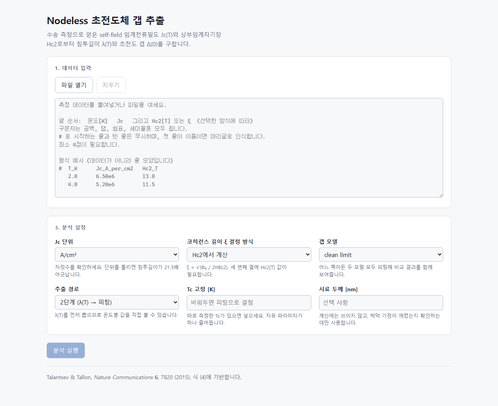
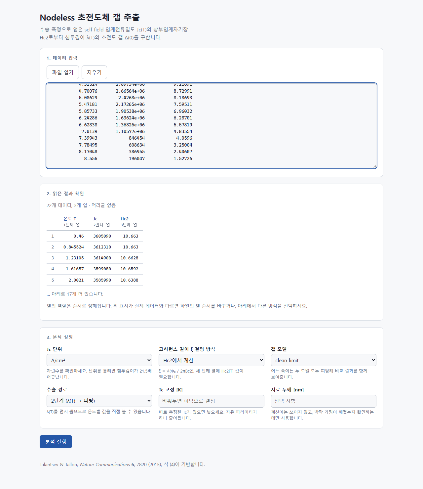
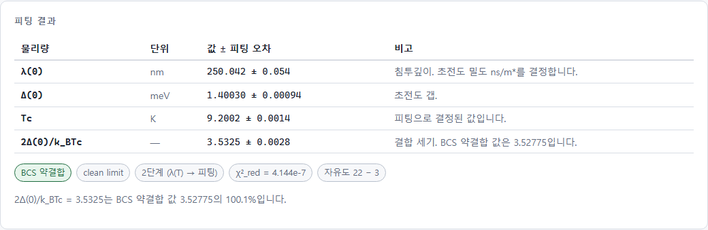
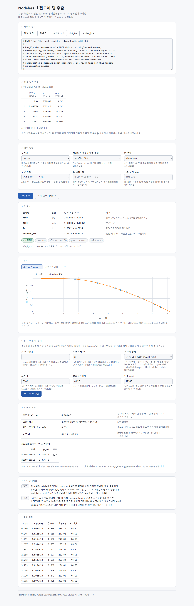
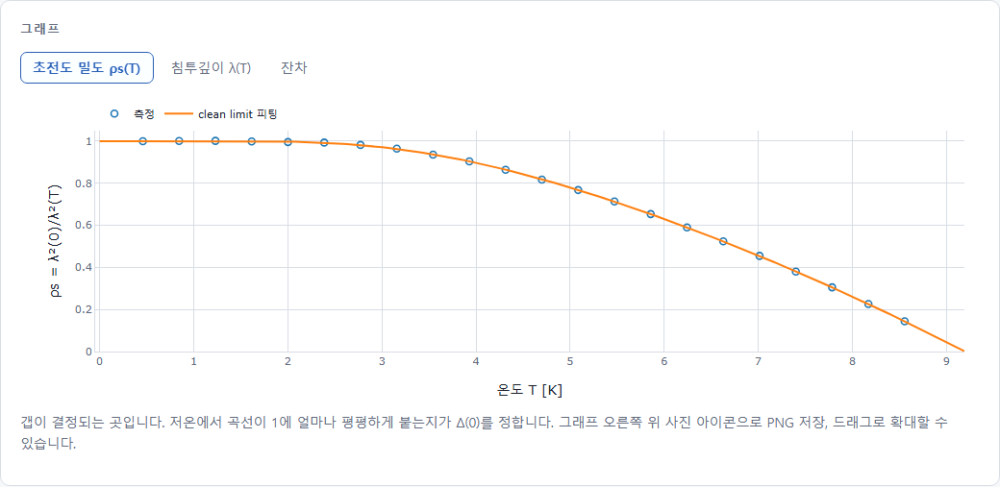
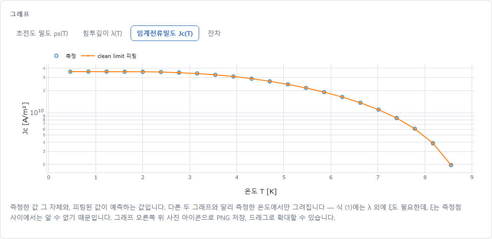
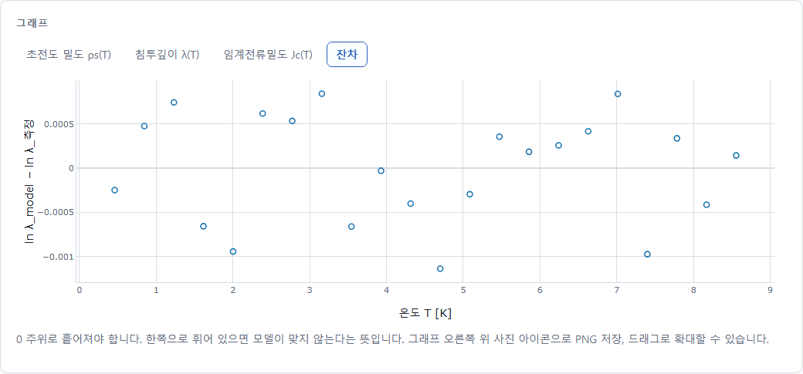
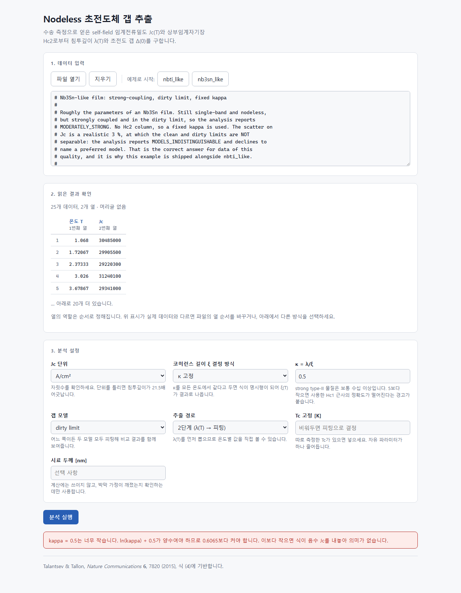

# 초전도 갭 추출기를 바닥부터 만든 기록

프로그래밍을 해 본 적 없는 실험물리학자가, AI 코딩 에이전트와 함께
**사양 주도 개발(SDD)** 방식으로 웹 애플리케이션 하나를 완성하기까지.
무엇을 설치했고, 어떤 순서로 진행했으며, 최종적으로 무엇이 나왔는지
하나도 빠뜨리지 않고 적었습니다.

| | |
| --- | --- |
| 작성 | 2026-08-25 |
| 대상 | 아무것도 모르는 상태에서 시작하는 사람 |
| 소요 | 나흘 (2026-08-22 → 08-25) |
| 커밋 | 17개 |

> 이 문서는 헌법 VIII조의 예외 조항(1.1.0)에 따라 한국어로 쓰였습니다.
> 같은 내용의 영어판은 [`manual.en.md`](manual.en.md)입니다.

---

## 목차

- [00. 이 문서에 대하여](#00-이-문서에-대하여)
- [01. 전체 지도](#01-전체-지도)
- [02. 준비물 — 무엇을 왜 설치하는가](#02-준비물--무엇을-왜-설치하는가)
- [03. Orca와 Claude Code](#03-orca와-claude-code--무엇이-무엇인가)
- [04. SDD — 사양 주도 개발](#04-sdd--사양-주도-개발)
- [05. Phase 0 → 10 — 실제로 있었던 일](#05-phase-0--10--실제로-있었던-일)
- [06. 대화 한 턴은 어떻게 생겼나](#06-대화-한-턴은-어떻게-생겼나)
- [07. 최종 결과물](#07-최종-결과물)
- [08. 다시 한다면 — 재현 체크리스트](#08-다시-한다면--재현-체크리스트)
- [09. 배운 것과 함정](#09-배운-것과-함정)
- [부록 A. 용어집](#부록-a-용어집)
- [부록 B. 자주 쓰는 명령 모음](#부록-b-자주-쓰는-명령-모음)

---

## 00. 이 문서에 대하여

2026년 8월 22일과 23일에 걸쳐, 초전도 박막의 자기장 없는 상태에서 측정한
임계전류밀도 `Jc(T)`로부터 런던 침투깊이 `λ(0)`와 초전도 에너지 갭 `Δ(0)`를
뽑아내는 웹 애플리케이션 하나를 만들었습니다.

그 자체도 결과물이지만, 이 문서가 다루는 것은 **만드는 방법**입니다. 같은
자리에서 다시 시작하는 사람이 이 문서만 보고 처음부터 끝까지 따라올 수 있도록,
설치할 프로그램 목록부터 최종 화면의 스크린샷까지 전부 적었습니다.

### 이 프로그램이 하는 일 — 한 줄로

초전도체 연구에는 **측정 비용의 비대칭**이라는 것이 있습니다. `Jc`와
상부임계자기장 `Hc2`는 4단자 수송 측정으로 하루면 얻습니다. 반면 침투깊이
`λ`를 재려면 뮤온 스핀 회전(μSR)이나 터널 다이오드 공진기가 필요하고, 갭 `Δ`를
재려면 터널링 분광이나 ARPES가 필요합니다. 박막 이론이 이 둘을 연결해 주므로,
싼 측정에서 비싼 물리량을 계산할 수 있습니다.

```
  Jc(T)   ──식(4) 역산──▶   λ(T)   ──정의──▶   ρs(T)   ──피팅──▶   Δ(0)
 4단자 수송 측정            침투깊이          초전도 밀도        초전도 갭
```

근거는 E. F. Talantsev & J. L. Tallon, *Universal self-field critical current
for thin-film superconductors*, **Nature Communications 6**, 7820 (2015)의
식 (4)입니다.

### 읽는 법

- 코드 블록 안의 글씨는 **터미널에 그대로 입력하는 명령**입니다. `#`으로
  시작하는 줄은 설명이므로 입력하지 않습니다.
- `이런 글씨`는 파일 이름, 폴더 이름, 명령어, 변수 이름입니다.
- 모든 명령은 **Windows 11 + PowerShell** 기준입니다. macOS나 Linux에서는
  경로 구분자가 `\`가 아니라 `/`이고, 가상환경 활성화 경로가 다릅니다.
- **PowerShell이 두 가지입니다.** 시작 메뉴의 "Windows PowerShell"은 5.1이고,
  "PowerShell 7"은 따로 설치해야 하는 최신판입니다. 이 문서의 명령은 양쪽에서
  모두 되도록 적었습니다 — `&&`처럼 5.1에서 안 되는 문법은 피했습니다.

> **바로 따라 해 보려는 분께**
>
> 처음 재현하는 분이 실제로 막힌 지점은 맨 앞이었습니다. "터미널은 열었는데
> AI와의 대화를 어떻게 시작하지?" 그 답만 먼저 보시려면
> [3.4절](#34-첫-세션-시작하기--새-프로젝트에서-대화가-열릴-때까지)로 가십시오.
> 설치가 아직이면 [2장](#02-준비물--무엇을-왜-설치하는가)이 먼저입니다.

> **이 문서의 정직성 원칙**
>
> 확인한 것과 확인하지 못한 것을 구분해서 씁니다. 예를 들어 Docker 이미지는
> **단 한 번도 빌드된 적이 없습니다** — 이 컴퓨터에 Docker가 설치되어 있지 않기
> 때문입니다. 그 사실을 감추지 않고, 무엇을 대신 확인했는지 Phase 7에
> 적었습니다. 검증되지 않은 것을 검증된 것처럼 적는 문서는 나중에 반드시
> 사고를 냅니다.

---

## 01. 전체 지도

자세한 이야기로 들어가기 전에, 전체가 어떤 모양인지 한 번 봐 두면 길을 잃지
않습니다. 크게 세 덩어리입니다.

| 단계 | 하는 일 | 끝나면 손에 남는 것 |
| --- | --- | --- |
| **준비** | 도구 6가지를 설치하고 계정을 연결 | 터미널에서 `claude`를 치면 AI가 대답하는 상태 |
| **설계** | 코드를 한 줄도 쓰지 않고 문서 7종을 먼저 작성 | "무엇을 왜 만드는가"가 글로 고정된 상태. 여기서 이미 물리 오류 2개를 잡았습니다 |
| **제작** | Phase 1부터 10까지, 각 단계마다 통과 조건(gate)을 걸고 순서대로 | 테스트 201개가 통과하는, 브라우저에서 도는 프로그램 |

> **왜 이 순서인가**
>
> 보통은 "일단 코드부터 짜 보고 되는지 본다"가 자연스럽게 느껴집니다. AI
> 에이전트와 일할 때 그게 특히 위험한 이유는, **AI가 모호한 지시를 거절하지 않고
> 그럴듯하게 채워 넣기 때문**입니다. 무엇을 만들지 글로 고정해 두지 않으면, 매
> 대화마다 조금씩 다른 물건이 만들어지고, 어느 쪽이 맞는지 판단할 기준이 아무
> 데도 없게 됩니다.
>
> 사양을 먼저 쓰는 것은 AI를 통제하기 위한 장치이면서, 동시에 **사람이 자기
> 생각을 검사하는 장치**이기도 합니다. 이 프로젝트에서는 코드가 한 줄도 없던
> Phase 0에서 이미 BCS 상수 불일치와 clean/dirty 곡선 교차라는 물리 문제 두 개가
> 드러났습니다.

---

## 02. 준비물 — 무엇을 왜 설치하는가

### 2.1 왜 도구가 여러 개 필요한가

실험실에 비유하면 이해가 빠릅니다. 측정 하나를 하려고 해도 크라이오스탯, 전원,
나노볼트미터, 데이터 수집 PC가 각각 필요하지 한 상자로 끝나지 않습니다.
소프트웨어도 같습니다.

| 도구 | 역할 — 실험실 비유 | 이 컴퓨터의 버전 |
| --- | --- | --- |
| Git | 실험 노트. 모든 변경을 되돌릴 수 있게 기록합니다 | 2.55.0 |
| Python | 계산을 실제로 수행하는 언어. 백엔드가 이걸로 돌아갑니다 | 3.12.10 |
| Node.js | 웹 화면을 만드는 도구 모음. 브라우저가 아니라 *화면을 조립하는 공장*입니다 | 24.19.0 |
| nvm-windows | Node.js의 버전을 여러 개 깔아 두고 골라 쓰게 해 주는 관리자 | — |
| Claude Code | AI 코딩 에이전트. 실제로 코드를 쓰고 테스트를 돌리는 상대 | 2.1.241 |
| Orca | Claude Code를 여러 개 띄워 놓고 관리하는 데스크톱 앱 | 설치됨 |
| Docker Desktop | 완성품을 어디서든 똑같이 돌아가게 포장하는 도구 | **미설치** |

### 2.2 하나씩 설치하기

#### ① Git — 버전 관리

Git은 "파일을 저장할 때마다 스냅샷을 찍어 두는 프로그램"이라고 생각하면 됩니다.
어제 잘 되던 게 오늘 안 되면 어제 상태로 정확히 되돌릴 수 있고, 무엇이 언제 왜
바뀌었는지가 전부 남습니다. AI와 일할 때는 이게 특히 중요합니다. AI가 파일
20개를 한 번에 고쳤을 때, Git이 없으면 무엇이 바뀌었는지 알 방법이 없습니다.

```powershell
# https://git-scm.com/download/win 에서 설치 프로그램 내려받아 실행
# 설치 옵션은 전부 기본값으로 두어도 됩니다.

# 설치 후 확인 — 버전이 찍히면 성공
git --version

# 최초 1회, 커밋에 남을 이름과 메일 설정
git config --global user.name  "ktkim"
git config --global user.email "kgtakee@gmail.com"
```

#### ② Python — 계산 엔진

물리 계산과 서버가 Python으로 되어 있습니다. 이 프로젝트는 3.11 이상을 요구하고,
이 컴퓨터에는 3.12.10이 깔려 있습니다.

```powershell
# https://www.python.org/downloads/windows/ 에서 설치
# ★ 설치 첫 화면의 "Add python.exe to PATH" 체크박스를 반드시 켜세요.
#   이걸 놓치면 터미널에서 python 명령을 못 찾습니다.

python --version
```

#### ③ nvm-windows + Node.js — 화면 만드는 공장

Node.js는 웹 화면(React)을 만들고 빌드하는 데 쓰입니다. 버전이 바뀌면 빌드가
깨지는 일이 흔해서, 버전 관리자인 nvm으로 깔아 두고 프로젝트마다 버전을 고정하는
것이 표준입니다. 이 프로젝트는 `frontend/.nvmrc`에 `24.19.0`을 적어 두었습니다.

```powershell
# https://github.com/coreybutler/nvm-windows/releases 에서 nvm-setup.exe

nvm install 24.19.0
nvm use 24.19.0

node --version   # v24.19.0
npm --version    # 11.17.0
```

> **npm이란**
>
> Node를 깔면 같이 들어오는 **패키지 관리자**입니다. 남이 만들어 둔 코드
> 묶음(라이브러리)을 내려받아 프로젝트에 붙입니다. `npm install`은 "이 프로젝트가
> 필요하다고 적어 둔 라이브러리를 전부 내려받아라"라는 뜻이고, 결과물은
> `node_modules` 폴더에 수만 개의 파일로 쌓입니다. 이 폴더는 **Git에 넣지
> 않습니다** — 언제든 다시 만들 수 있으니까요.

#### ④ Claude Code — AI 코딩 에이전트

채팅창에 질문하는 AI와는 다릅니다. Claude Code는 **터미널에서 돌면서 실제로
파일을 읽고, 고치고, 명령을 실행하고, 테스트를 돌려 보고, 실패하면 스스로
고치는** 프로그램입니다. 이 프로젝트의 코드는 사실상 전부 Claude Code가 썼고,
사람은 무엇을 왜 만들지 정하고 결과를 판정했습니다.

```powershell
# 이 컴퓨터에 실제로 깔린 방식 — 공식 설치 프로그램
# https://claude.com/claude-code 의 안내를 따르면
# C:\Users\<이름>\.local\bin\claude.exe 에 설치됩니다.

# 확인
claude --version

# 프로젝트 폴더로 이동한 뒤 실행
cd C:\Users\kgtak\projects\nodeless-sc-gap
claude
```

> **버전 번호가 문서와 다를 것입니다**
>
> Claude Code는 스스로 갱신됩니다. 이 문서를 처음 쓸 때 2.1.241이었고 며칠 뒤
> 2.1.245였습니다. 숫자가 다르다고 잘못된 게 아닙니다.
>
> Node가 이미 있으면 `npm install -g @anthropic-ai/claude-code`로도 깔 수
> 있습니다. **다만 이 프로젝트에서 쓴 것은 그쪽이 아닙니다** — 확인해 보니
> npm 전역 폴더에는 들어 있지 않고 `.local\bin`에만 있었습니다. 둘 중 하나만
> 쓰십시오. 둘 다 깔면 어느 쪽이 실행되는지가 `PATH` 순서에 달리게 됩니다.
> 지금 무엇이 실행되는지는 `(Get-Command claude).Source`로 확인합니다.

첫 실행에서 어떤 화면이 나오고 어떻게 나가는지는
[3.4절](#34-첫-세션-시작하기--새-프로젝트에서-대화가-열릴-때까지)에 있습니다.

#### ⑤ Orca — 에이전트 여러 개를 관리하는 창

자세한 내용은 [Section 03](#03-orca와-claude-code--무엇이-무엇인가)에 따로
적었습니다. 결론부터 말하면 **없어도 됩니다.** Claude Code만으로 이 프로젝트
전체를 만들 수 있습니다. Orca는 그 위에 얹는 편의 도구입니다.

#### ⑥ Docker Desktop — 포장 도구 (이 프로젝트에서는 미설치)

Docker는 프로그램과 그것이 필요로 하는 모든 것(Python 버전, 라이브러리, 설정)을
한 상자에 넣어서, 다른 컴퓨터에서도 *똑같이* 돌아가게 만드는 도구입니다.
"제 컴퓨터에서는 되는데요"라는 문제를 없애는 물건입니다.

> **확인되지 않은 부분**
>
> 이 프로젝트에는 `Dockerfile`과 `docker-compose.yml`이 완성되어 있지만,
> **이미지는 한 번도 빌드된 적이 없습니다.** Docker Desktop 설치에 관리자 권한이
> 필요한데 이 컴퓨터에서는 그것을 쓸 수 없었기 때문입니다. Docker를 깔았다면
> 다음 한 줄로 확인하십시오.
>
> ```powershell
> docker compose up --build   # 그 뒤 http://localhost:8000
> ```

#### 선택 사항

- **Visual Studio Code** — 코드를 눈으로 보고 싶을 때. Claude Code가 전부
  처리하므로 필수는 아니지만, 파일 구조를 훑어보기에 편합니다.
- **Obsidian** — 마크다운 문서를 읽는 프로그램. SDD 문서 7종과 이 매뉴얼이 전부
  마크다운이라, 링크를 따라가며 읽기에 좋습니다.

### 2.3 프로젝트를 놓을 자리 — 실제로 사고가 난 부분

> **경로 규칙**
>
> 프로젝트 폴더 경로는 다음 세 조건을 지켜야 합니다.
>
> - **한글이 없을 것.** 경로에 한글이 들어가면 일부 도구가 인코딩을 잘못 읽어
>   파일을 못 찾습니다.
> - **공백이 없을 것.** 공백은 명령줄에서 인자 구분자라, 따옴표를 빠뜨린
>   스크립트가 조용히 오작동합니다.
> - **OneDrive·Dropbox 같은 동기화 폴더 밖일 것.** 동기화 클라이언트가 파일을
>   잡고 있으면 빌드가 간헐적으로 실패하고, 원인을 찾기가 매우 어렵습니다.
>
> 이 프로젝트는 처음에
> `C:\Users\kgtak\OneDrive\바탕 화면\개인 폴더\Program\Nodeless SC_Jc cal`에
> 있었고, 세 조건을 전부 어기고 있었습니다. 그래서
> `C:\Users\kgtak\projects\nodeless-sc-gap`으로 옮겼습니다.

이사할 때 알아 둘 것:

- `.venv`(Python 가상환경)와 `node_modules`는 **복사하지 말고 새로 만듭니다.**
  내부에 원래 경로가 절대경로로 박혀 있어서, 옮기면 깨집니다.
- OneDrive 밖으로 나오면 **자동 백업이 사라집니다.** 대체 수단은 Git 원격
  저장소(GitHub 등)입니다. 이 프로젝트는 아직 원격을 설정하지 않았습니다.

```powershell
# 새 위치에서 환경 다시 만들기 — 최초 1회
cd C:\Users\kgtak\projects\nodeless-sc-gap\backend
python -m venv .venv
.\.venv\Scripts\python.exe -m pip install -e ".[dev]"

cd ..\frontend
nvm use            # .nvmrc를 읽어 24.19.0으로 전환
npm install
npx playwright install chromium
```

> **가상환경(venv)이란**
>
> Python 라이브러리를 컴퓨터 전체가 아니라 **이 프로젝트 폴더 안에만** 설치하는
> 격리 공간입니다. 프로젝트 A가 numpy 1.26을, 프로젝트 B가 2.0을 요구할 때 서로
> 싸우지 않게 해 줍니다. `backend\.venv\Scripts\python.exe`가 그 안의 파이썬이고,
> 이 프로젝트의 명령들은 항상 그 경로를 직접 부릅니다.

---

## 03. Orca와 Claude Code — 무엇이 무엇인가

### 3.1 Claude Code

터미널에서 도는 AI 에이전트입니다. 실행하면 대화창이 뜨고, 사람이 한국어로
지시하면 AI가 파일을 읽고 고치고 명령을 실행합니다. 중요한 특성 몇 가지:

- **프로젝트 폴더를 인식합니다.** 실행한 폴더가 작업 공간이 되고, 그 안의 파일만
  다룹니다.
- **`CLAUDE.md`를 자동으로 읽습니다.** 프로젝트 최상단에 이 파일을 두면 새 대화가
  시작될 때마다 자동으로 읽히므로, 매번 같은 설명을 반복할 필요가 없습니다.
- **대화가 저장됩니다.** `claude --resume` 또는 대화 중 `/resume`으로 이전 대화를
  이어서 할 수 있습니다.
- **대화가 길어지면 요약됩니다.** AI가 한 번에 기억할 수 있는 양에는 한계가 있어서,
  넘치면 자동으로 압축합니다. `/compact`로 직접 시킬 수도 있습니다.

### 3.2 Orca

Orca는 Claude Code(그리고 Codex 같은 다른 에이전트)를 **여러 개 동시에 띄워 놓고
GUI로 관리하는 데스크톱 앱**입니다. 이 컴퓨터에 설치되어 있고, 남은 흔적으로 다음을
확인했습니다.

| Orca가 설치한 것 | 하는 일 |
| --- | --- |
| `~/.orca/agent-hooks/claude-hook.cmd` | 에이전트가 어떤 상태인지 Orca 창에 실시간으로 알려 주는 작은 스크립트 |
| `~/.claude/settings.json`의 hook 8종 | 대화 시작, 도구 사용 전후, 응답 종료, 권한 요청 등 *사건이 일어날 때마다* 위 스크립트를 부르도록 Claude Code에 등록된 갈고리 |
| statusline | Claude Code 화면 아래에 현재 상태 줄을 그려 주는 명령 |
| git worktree | 같은 저장소를 여러 폴더에 동시에 펼쳐 두고, 에이전트마다 다른 브랜치를 주는 기능 |

> **hook이란**
>
> "어떤 사건이 일어나면 이 명령을 대신 실행해 달라"고 미리 등록해 두는 장치입니다.
> Claude Code는 `~/.claude/settings.json`에 hook 목록을 두고, 대화가 끝날 때
> (`Stop`), 도구를 쓰기 전(`PreToolUse`) 같은 시점마다 등록된 명령을 실행합니다.
> Orca는 이 자리에 자기 스크립트를 꽂아서 에이전트의 상태를 실시간으로 받아
> 갑니다. **AI가 아니라 프로그램이 실행하는 것**이라, "앞으로 매번 ~해 줘" 같은
> 자동화는 기억이 아니라 hook으로 구현해야 합니다.

### 3.3 Orca가 없어도 되는가 — 됩니다

이 프로젝트에서 Orca가 한 일은 *편의*에 가깝습니다. 실제 작업은 전부 Claude
Code가 했고, 만들어진 파일 어디에도 Orca에 의존하는 부분이 없습니다. Orca 없이
따라 하려면 터미널을 열고 `claude`를 치면 그만입니다.

> **실제로 겪은 부작용 — worktree 잔재**
>
> Orca는 에이전트마다 독립된 작업 공간을 주려고 **git worktree**를 만듭니다. 같은
> 저장소를 다른 폴더에 한 벌 더 펼쳐 놓고 다른 브랜치를 체크아웃하는 기능입니다.
> 이 프로젝트에서는 `C:\Users\kgtak\nodeless-sc-gap\burbot`에 그런 폴더가
> **정리되지 않은 채 남아 있었습니다.** 초기 커밋 상태로 멈춰 있었고, 거기에 물린
> `burbot` 브랜치는 삭제도 되지 않았습니다.
>
> ```powershell
> git worktree list           # 지금 펼쳐진 작업 공간 목록
> git worktree prune          # 사라진 폴더의 등록 정보 정리
> git branch -d burbot        # 그제야 브랜치 삭제 가능
> ```
>
> 주기적으로 `git worktree list`와 `git branch`를 확인해 모르는 항목이 있으면
> 정리하십시오.

### 3.4 첫 세션 시작하기 — 새 프로젝트에서 대화가 열릴 때까지

> 이 절은 **이 문서를 보고 처음 재현하던 사람이 실제로 여기서 막혀서** 나중에
> 추가한 것입니다. 나머지 내용이 전부 "그 다음"을 다루고 있었습니다.

**먼저 알아 둘 것: 대화창이 따로 뜨지 않습니다.** 채팅 프로그램처럼 새 창이
열리는 게 아니라, **지금 명령을 치고 있는 그 터미널이 그대로 대화창이 됩니다.**
`claude`를 치면 잠시 뒤 입력줄이 나타나고, 거기에 한국어로 말을 걸면 됩니다.
이걸 모르면 "창이 안 뜨는데?" 하고 멈추게 됩니다.

#### 폴더를 새로 만드는 경우

```powershell
mkdir C:\Users\kgtak\projects\my-new-project
cd C:\Users\kgtak\projects\my-new-project
git init
claude
```

폴더 이름은 [2.3절의 경로 규칙](#23-프로젝트를-놓을-자리--실제로-사고가-난-부분)을
지켜야 합니다 — **한글 없이, 공백 없이, OneDrive 밖.** 예시가 영문 소문자에
붙임표인 것은 그 때문입니다.

#### 이미 파일이 들어 있는 폴더에서 시작하는 경우

기존 코드나 초안 문서를 놓아 둔 폴더에서 시작하는 쪽이 오히려 흔합니다. 이때는
**`claude`를 치기 전에 지금 상태를 먼저 박제해 두십시오.**

```powershell
cd C:\Users\kgtak\projects\my-new-project
git init
git add -A
git commit -m "Existing files before the rebuild begins"
claude
```

세 번째 줄까지 끝내면 지금 이 상태로 **언제든 정확히 되돌아올 수 있습니다.**
그러지 않으면 AI가 파일 스무 개를 한 번에 고쳤을 때 돌아갈 곳이 없습니다.

> **`git init`을 건너뛰면 Orca도 막힙니다**
>
> Orca는 에이전트마다 **git worktree**를 만들어 작업을 격리합니다(3.2절).
> worktree는 git 저장소에만 만들 수 있으므로, 저장소가 아닌 폴더는 Orca가 받아
> 주지 않습니다. Orca를 쓰든 안 쓰든 `git init`이 먼저입니다.

#### 처음 실행하면 무엇이 보이나

1. **최초 1회만** 브라우저가 열리며 Anthropic 계정 로그인을 요구합니다. Claude
   Pro/Max 구독이나 API 크레딧이 필요합니다.
2. 로그인 뒤 터미널에 입력줄이 나타납니다. 이제 한국어로 말을 걸면 됩니다.
3. 첫마디로는 [8장 1단계의 헌법 프롬프트](#1단계--헌법)가 적당합니다.

#### 나가기와 이어 하기

| 하고 싶은 것 | 방법 |
| --- | --- |
| 대화 끝내기 | `/exit`, 또는 Ctrl+C 두 번 |
| 다음에 이어서 | `claude --continue` (직전 대화), `claude --resume` (골라서) |
| 셸 명령을 직접 실행 | 입력줄에서 `!` 뒤에 명령 — 예: `!git status` |

`!`는 특히 유용합니다. `gcloud auth login`처럼 사람이 직접 답해야 하는 명령을
그 자리에서 돌리고, 결과가 대화에 그대로 들어옵니다.

---

## 04. SDD — 사양 주도 개발

### 4.1 무엇을 해결하는 방법인가

SDD(Spec-Driven Development, 사양 주도 개발)는 **코드보다 문서를 먼저 쓰고,
코드가 문서를 따라가게 하는** 개발 방식입니다. 논문 쓰기에 비유하면, 실험을 다
하고 나서 논문을 쓰는 게 아니라 *무엇을 왜 측정할지를 먼저 글로 확정하고* 그
계획대로 측정하는 것에 가깝습니다.

AI 에이전트와 일할 때 이 방식이 특히 잘 맞는 이유는 세 가지입니다.

1. **AI는 모호함을 지적하지 않고 채웁니다.** "피팅해 줘"라고 하면 어떤 잔차를
   쓸지 스스로 정해 버립니다. 사양에 적혀 있으면 그럴 여지가 없습니다.
2. **대화는 사라지지만 문서는 남습니다.** 새 대화를 시작하면 AI는 어제 이야기를
   기억하지 못합니다. 문서가 기억 장치입니다.
3. **판정 기준이 생깁니다.** "이게 다 된 건가?"라는 질문에 대해, 사양의 요구사항
   30개가 각각 작업과 테스트에 연결되어 있으면 기계적으로 답할 수 있습니다.

### 4.2 다섯 개의 문서, 다섯 개의 질문

| 파일 | 답하는 질문 | 절대 하지 말 것 |
| --- | --- | --- |
| `constitution.md` | 이 프로젝트가 절대 어기지 않는 규칙은? | 편의를 위해 조용히 어기기. 고치려면 문서를 먼저 개정해야 합니다 |
| `spec.md` | 무엇을, 왜 만드는가? | **기술 이름을 쓰기.** Python, React, JSON 같은 단어가 한 번도 나오지 않습니다 |
| `research.md` | 쓰는 수식·상수·수치 기법의 근거는? | 코드에서 다시 유도하기. 전부 여기 적혀 있습니다 |
| `plan.md` | 그것을 어떤 기술로 어떻게? | 여기서 무엇을 만들지 새로 정하기 |
| `tasks.md` | 구체적으로 어떤 순서로 무엇을? | 통과 조건(gate) 없이 작업 나열하기 |

이 프로젝트에는 여기에 두 개가 더 있습니다. `data-model.md`(데이터 구조와 오류
코드 목록)와 `contracts/openapi.yaml`(화면과 서버가 주고받을 형식의 계약서).
합쳐서 `specs/001-jc-to-gap/` 아래 문서 7종입니다.

### 4.3 constitution — 실제로 걸어 둔 아홉 개의 규칙

헌법이라는 이름 그대로, 나중에 편의상 어기고 싶어지는 것들을 미리 못 박아 둔
문서입니다.

| 조 | 내용 | 왜 |
| --- | --- | --- |
| I | 물리 계산 코드(`core/`)는 웹 프레임워크를 import하지 않는다 | 프레임워크는 몇 년마다 바뀌지만 Talantsev–Tallon 식은 안 바뀝니다. **테스트로 강제** |
| II | 물리량을 계산하는 함수는 반드시 "알려진 답"에 대한 테스트를 가진다 | 틀린 피팅은 오류를 내지 않고 *그럴듯한 숫자*를 냅니다 |
| III | 사양이 구현보다 앞선다. 사양이 틀렸으면 사양을 먼저 고친다 | 구현이 앞서면 문서는 그 순간 거짓말이 됩니다 |
| IV | 백엔드는 사람이 읽을 문장을 절대 반환하지 않는다. 오류는 코드로 | 영어 코드 안에 한국어 문장이 섞이는 것을 막습니다. **테스트로 강제** |
| V | 계산 내부는 전부 SI 단위. 비-SI 값을 담은 변수는 이름에 단위를 쓴다 | 단위 혼동은 물리 코드의 1위 오류 원인입니다 |
| VI | 결과에는 그 결과가 기댄 가정과 위반 여부가 함께 따라간다 | 식은 가정을 다 어긴 입력에도 숫자를 돌려줍니다 |
| VII | 난수를 쓰는 계산은 시드를 받고, 쓴 시드를 함께 보고한다 | 매번 달라지는 오차 막대는 인용할 수 없습니다 |
| VIII | 코드·문서·커밋은 영어, 화면은 한국어 | (1.1.0에서 `docs/`의 교육 자료에 예외가 생겼습니다 — 이 매뉴얼이 그 예외입니다) |
| IX | 단순한 쪽이 기본. 복잡도를 추가하려면 `plan.md`에 근거를 쓴다 | 유지보수자가 전업 프로그래머가 아니기 때문입니다 |

> **규칙을 테스트로 강제한다는 뜻**
>
> I조와 IV조는 글로만 있는 게 아니라 실제 테스트로 걸려 있습니다.
> `tests/test_core_purity.py`는 `core/` 아래 모든 파일의 import 문을 훑어서 웹
> 프레임워크가 하나라도 들어오면 빌드를 실패시킵니다. `tests/test_api.py`는 서버
> 응답에 ASCII가 아닌 글자(=한국어)가 하나라도 있으면 실패시킵니다.
> **지킬 수밖에 없는 규칙이 진짜 규칙입니다.**

### 4.4 spec에 기술 이름을 쓰지 않는 규칙

`spec.md`에는 "Python", "React", "CSV", "버튼" 같은 단어가 한 번도 나오지
않습니다. 대신 이렇게 씁니다: *"사용자는 온도와 임계전류밀도의 표를 제공할 수
있어야 한다"*, *"결과는 기기 밖으로 나갈 수 있어야 한다"*.

이유는 2년 뒤에도 이 문서가 유효하기 위해서입니다. React가 다른 것으로 바뀌어도
"무엇을 만들려 했는가"는 그대로 남습니다. 기술 선택은 전부 `plan.md`가
담당합니다.

### 4.5 gate — 통과 조건

`tasks.md`의 각 Phase 끝에는 **gate**가 붙어 있습니다. "이 조건이 만족되기
전에는 다음 Phase로 넘어가지 않는다"는 선입니다. 예를 들어 Phase 1의 gate는
*"`pytest`가 전부 통과할 것, 특히 왕복 테스트 `T118`"* 이었습니다.

gate가 없으면 "대충 되는 것 같으니 다음으로"가 반복되다가, 나중에 어디서부터
잘못됐는지 못 찾게 됩니다.

### 4.6 spec-kit이라는 도구 — 우리는 쓰지 않았습니다

> **정확히 해 둘 것**
>
> GitHub에는 **spec-kit**이라는 SDD 도구가 있고, `specify init`으로 폴더 구조와
> 슬래시 명령(`/speckit.specify` 등)을 자동 생성해 줍니다. 이 프로젝트의
> `.specify/`, `specs/001-jc-to-gap/`이라는 구조는 그 도구의 *모양*을 따른
> 것이지만, **도구 자체는 설치하지 않았습니다.** 근거: `.specify/` 안에는
> `memory/constitution.md` 하나뿐이고, spec-kit이 만드는
> `scripts/`·`templates/`·`.claude/commands/`가 없습니다.
>
> 즉 문서 7종은 전부 대화로 만들어졌습니다. 도구를 쓰면 더 편하지만, 쓰지 않아도
> SDD는 가능합니다. **SDD는 도구가 아니라 순서입니다.**

---

## 05. Phase 0 → 10 — 실제로 있었던 일

여기서부터는 실제 진행 기록입니다. 커밋 10개가 그대로 단계에 대응합니다. 각
항목의 **실제로 있었던 일**이 이 매뉴얼에서 가장 값진 부분입니다 — 계획대로 되지
않은 지점이 곧 배울 것이 있는 지점이기 때문입니다.

### Phase 0-a — 저장소와 헌법 세우기 · `356e8a9`

- **한 일** — `git init`, `.gitignore`·`.gitattributes` 작성, 헌법 9조 작성,
  기존 CLI 스크립트 3개를 `legacy/`로 보관
- **코드** — 한 줄도 없음

기존에 쓰던 명령줄 스크립트 3개는 지우지 않고 `legacy/`에 넣었습니다. **코드는
물려받지 않되, 숫자로는 대조합니다.** 나중에 `test_legacy_agreement.py`가 옛
스크립트를 실제로 실행해서 새 코드가 같은 `λ(T)`를 내는지 1e-9 정밀도로
검사합니다. 옛 코드를 "정답지"로 쓰되 구조는 새로 짜는 방식입니다.

### Phase 0-b — 사양 문서 7종, 코드 이전에 물리를 확정 · `724cdc6`

- **한 일** — `spec.md`(요구사항 30개, 인수 시나리오 10개), `research.md`,
  `data-model.md`, `plan.md`, `contracts/openapi.yaml`, `quickstart.md`,
  `tasks.md`
- **gate** — 요구사항 30개가 전부 작업 하나 이상에 연결될 것

> **코드 없이 잡은 물리 오류 2개**
>
> - **BCS 약결합 상수가 서로 안 맞았습니다.** 3.5279와 2×1.7639가 같은 값이어야
>   하는데 달랐습니다. `2π/e^γ = 3.52775`, `1.763875`로 정정.
> - **clean과 dirty 초전도 밀도 곡선이 `T/Tc ≈ 0.25` 아래에서 교차합니다.**
>   물리가 아니라 `tanh` 갭 보간식의 잔차 때문입니다. 이걸 미리 알아냈기 때문에,
>   "거기서 dirty가 항상 크다"고 단정하는 테스트를 *애초에 쓰지 않을 수*
>   있었습니다.

또 하나 중요한 발견: `Jc`의 불확실도 5%가 **보정 오차**(전체에 공통)인지
**점별 산포**인지에 따라 `Δ(0)`의 오차가 0이 되기도 하고 몇 %가 되기도 합니다.
고정 `κ` 모드에서 공통 배수 오차는 `ρs`가 비율이라 정확히 상쇄되기 때문입니다.
이 발견 때문에 요구사항 FR-029, FR-030이 *추가*되었습니다. 사양을 쓰는 행위
자체가 설계를 바꾼 사례입니다.

### Phase 1 — 물리 코어, 웹 없이 물리만 먼저 확정 · `c506fe0`

- **한 일** — `backend/app/core/` 11개 모듈 + 테스트. 웹 프레임워크는 아직
  등장하지 않습니다
- **gate** — `pytest` 통과, 특히 **왕복 테스트** — 139 tests passed

> **왕복 테스트 — 이 프로젝트에서 가장 중요한 테스트**
>
> `λ0 = 200 nm`, `Δ0 = 1.5 meV`, `Tc = 10 K`, `κ = 40`이라는 *정답을 알고 있는*
> 값으로 가짜 `Jc(T)`를 만들어 낸 다음, 그것을 프로그램에 넣어서 원래 값 세 개가
> 되돌아 나오는지 봅니다. 결과는 상대오차 1e-9 이하.
>
> 왜 이게 결정적이냐면 — **계수 하나가 2배 틀리거나, 부호가 뒤집혔거나, 단위
> 변환을 빠뜨렸을 때, 프로그램은 오류를 내지 않고 그럴듯한 숫자를 냅니다.**
> 눈으로도, 코드 리뷰로도, 타입 검사로도 못 잡습니다. 아는 답으로 왕복시키는
> 것만이 잡습니다.

#### 측정이 사양을 뒤집은 네 가지

이 단계에서 사양이 틀렸다는 것이 네 번 드러났습니다. 네 번 모두 **사양을 먼저
고치고 근거 숫자를 `research.md`에 기록한 다음** 코드를 고쳤습니다.

| 항목 | 사양의 지시 | 측정 결과 |
| --- | --- | --- |
| 수치적분 | 적응형 구적법 | 몬테카를로 1회에 **8시간**이 걸릴 전망. 80점 Gauss–Legendre를 4구간으로 나눈 고정 규칙이 **4.4e-16** 일치에 **250배** 빠름 → 3분 |
| 잔차 정의 | 초전도 밀도 기준 | 값은 맞지만 분산이 불균일해, 공분산 공식이 `Tc`의 표준오차를 **2배** 틀리게 보고. 400회 부트스트랩 결과 **log-λ** 잔차가 7% 이내로 정직하고 편향도 5배 작음 |
| 모델 비교 | χ² 20% 마진 | 표본 수를 무시해서, 데이터를 더 모아도 판정이 나아지지 않음. `ΔAIC ≥ 10`으로 바꾸니 20점→160점에서 정답률 11%→59%로 개선 |
| 해 탐색 | — | `λ > ξ` 가지를 뒤지면 **κ > 1만 나올 수 있음**이 판명. 해가 없는 것은 solver 실패가 아니라 *데이터에 관한 진술*이므로 오류 코드의 의미를 재정의 |

### Phase 2 — HTTP 계층, 물리를 브라우저에서 부를 수 있게 · `8938a63` `32605a3`

- **한 일** — FastAPI로 엔드포인트 9개, Pydantic 입력 검증, 몬테카를로 백그라운드 잡
- **gate** — `http://localhost:8000/docs`에서 모든 엔드포인트를 손으로 호출 —
  166 tests passed

> **엔드포인트 / API란**
>
> 웹 프로그램은 "화면"과 "계산 서버" 두 부분으로 나뉩니다. 화면이 서버에 *"이
> 데이터로 분석해 줘"*라고 요청하는 창구가 **엔드포인트**이고, 창구 전체를 묶어
> **API**라고 부릅니다. 이 프로젝트의 창구는 `/api/parse`(표 읽기),
> `/api/lambda`(λ 계산), `/api/analyze`(전체 분석), `/api/uncertainty`(오차 전파)
> 등 열 개입니다.
>
> FastAPI는 이 창구 목록으로부터 **`/docs`라는 시험용 웹페이지를 자동으로 만들어
> 줍니다.** 화면을 한 줄도 만들기 전에 브라우저에서 직접 눌러 볼 수 있다는
> 뜻이고, 그래서 Phase 3이 "추측"이 아니라 "돌아가는 서버"를 상대로 진행될 수
> 있었습니다.

오류 코드를 HTTP 상태로 옮기는 표는 `main.py` 한 곳에만 둡니다. 예외 클래스에
붙이면 물리 코드가 HTTP에 관한 의견을 갖게 되고, 그건 헌법 I조 위반입니다.

두 번째 커밋(`32605a3`)은 코드가 아니라 **계약서를 고친 것**입니다. Phase 1에서
모델 비교 기준이 χ²에서 AIC로 바뀌었는데 `openapi.yaml`이 옛 규칙을 설명하고
있었습니다. 헌법 III조대로, 문서를 먼저 맞췄습니다.

### Phase 3 — React 화면, 타입을 서버에서 자동 생성 · `33b4a6c`

- **한 일** — Vite + React + TypeScript로 화면 구성, 컴포넌트 8개, 한국어 문구 파일
- **gate** — 브라우저에서 예제 하나가 입력→분석→결과까지 통과

> **"타입을 생성한다"가 왜 중요한가**
>
> 화면 코드는 서버가 무엇을 돌려주는지 알아야 합니다. 보통은 사람이 손으로 적어
> 두는데, 서버가 바뀌면 그 메모는 조용히 거짓말이 됩니다.
>
> 이 프로젝트는 `npm run gen:api` 한 줄로 **돌아가는 서버에서 형식을 읽어다가
> TypeScript 코드 924줄을 자동 생성**합니다. 서버가 바뀌면 화면 코드가 *컴파일
> 오류*를 냅니다. 조용한 거짓말이 시끄러운 오류로 바뀌는 것 — 이게 TypeScript를
> 쓰는 유일한 이유입니다.

> **첫 빌드에서 곧바로 설계 결함을 잡았습니다**
>
> 생성된 타입으로 컴파일하자마자 `root_xtol`, `root_rtol`이 **필수 항목**으로
> 빠져 있다는 오류가 났습니다. 이 둘은 Brent 근찾기 알고리즘의 종료 조건인데,
> 사양에 분석 설정으로 적혀 있었던 탓에 모든 화면이 *고를 근거도 이유도 없는 숫자
> 두 개*를 반드시 보내야 하는 상태가 되어 있었습니다(그 수치 오차는 실험
> 불확실도보다 몇 자릿수 아래입니다). 코어 내부 값으로 내리고 문서에 이유를
> 적었습니다. **사용자가 나중에 발견했을 설계 결함을 컴파일러가 1분 만에 잡은
> 것입니다.**

한국어 문장이 들어 있는 파일은 프로젝트 전체에서
`frontend/src/errorMessages.ts` **하나뿐**입니다(이 매뉴얼 이전까지는).
오류 코드 하나하나에 "무슨 일이 있었고, 어디서, 어떻게 하면 되는지"를
적었습니다. 모르는 코드가 오면 조용히 넘어가지 않고 눈에 띄게 표시해서, 번역
누락이 숨지 못하게 했습니다.

### 중간 점검 — Playwright 도입, 화면을 실제로 눈으로 보다 · `dbc3306`

Playwright는 **브라우저를 프로그램이 자동으로 조작하는 도구**입니다. "예제
버튼을 누르고, 분석을 실행하고, 결과 표에 λ(0)이 나오는지 확인한다"를 사람 대신
반복합니다. `quickstart.md`에 글로 적어 둔 인수 시나리오 10단계 중 8단계가
이걸로 *실행되는* 검사가 되었습니다.

> **눈으로 보니 나온 결함 — 단위 테스트가 못 잡던 것들**
>
> - **낡은 데이터로 분석이 실행될 수 있었습니다.** 새 데이터를 붙여넣은 직후 아주
>   짧은 순간에 "분석" 버튼이 여전히 *이전* 데이터를 가리키고 있었습니다. 실제로
>   스크린샷 촬영이 조용히 엉뚱한 예제를 찍었습니다.
> - **서버가 꺼져 있으면 아무 말도 없었습니다.** 예제 목록이 실패를 삼켜서, 서버가
>   죽은 화면과 예제가 없는 화면이 똑같이 보였습니다.
> - **한국어가 단어 중간에서 잘렸습니다.** "필요합니 / 다." — CSS
>   `word-break: keep-all`로 해결.
> - **화면을 좁히면 표가 뭉개졌습니다.** 420px에서 "meV"가 한 글자씩 세 줄로
>   쌓였습니다.
>
> 네 가지 모두 백엔드 테스트 166개가 전부 통과하는 상태에서 존재했습니다.
> **보지 않으면 모르는 종류의 결함이 있습니다.**

### Phase 4–6 — 그래프 · 불확실도 전파 · 진단 · `8d46d44`

- **Phase 4** — Plotly로 그래프 3종(초전도 밀도, 침투깊이, 잔차), PNG 저장,
  CSV 내려받기
- **Phase 5** — 몬테카를로 오차 전파를 *백그라운드 작업*으로. 진행률 표시,
  그동안 화면은 계속 쓸 수 있음
- **Phase 6** — 진단 패널 — χ², 결합 세기 판정, clean vs dirty 비교, 가정 위반 경고
- **gate** — 166 backend + 23 e2e tests

**잔차 그래프가 왜 있는가.** χ²가 작아도 곡선을 그려 보면 뻔히 보이는 계통적
어긋남이 있을 수 있습니다. 숫자 하나로는 못 보고 그림으로만 보이는 것이 있어서,
세 번째 탭이 잔차입니다.

> **헌법이 실제로 작동한 순간**
>
> 측정점을 초전도 밀도 그래프에 찍으려면 `λ0²/λ²`이 필요합니다. 화면
> 코드(TypeScript)에서 나눗셈 한 번이면 되는 일입니다. 하지만 그러면 물리적
> 정의가 두 군데에 존재하게 됩니다. 헌법 I조에 따라 이 값을 **백엔드가 계산해서
> 결과에 담아 보내도록** 옮겼습니다. "TypeScript에서는 물리량을 한 줄이라도
> 계산하지 않는다"는 규칙이 지금도 `CLAUDE.md`에 적혀 있습니다.

상관 모드(`SYSTEMATIC` / `INDEPENDENT`)는 그냥 선택지로 두지 않고 *왜 골라야
하는지 설명*을 붙였습니다. 같은 "Jc 5%"가 어떤 종류의 오차냐에 따라 `Δ(0)`의
오차가 0이 되기도 하고 몇 %가 되기도 하기 때문입니다.

### Phase 7 — 컨테이너화와 README · `cbca67f`

- **한 일** — 다단계 `Dockerfile`(Node가 화면을 빌드 → Python이 실행),
  `docker-compose.yml`, 헬스체크, 루트 `README.md`
- **gate** — **부분 통과 — 그리고 그렇다고 기록함**

> **다단계 빌드란**
>
> 1단계에서 Node로 화면을 빌드하면 결과는 정적 파일 몇 개입니다. 그런데 빌드에
> 쓰인 `node_modules`는 수백 MB입니다. 다단계 빌드는 **1단계의 결과물만 2단계로
> 넘기고 나머지는 버립니다.** 최종 이미지에는 Python 실행 환경과 완성된 화면
> 파일만 들어갑니다.

> **검증하지 못한 것 — 정직하게**
>
> Docker가 없어서 이미지는 빌드되지 않았습니다. 데몬 없이 확인 가능한 것은 전부
> 확인했습니다.
>
> - 1단계의 빌드 명령을 실제로 실행 → 자산 번들 생성 확인
> - 의존성 계층이 `pyproject.toml`만으로 설치되는지 확인
> - 이미지가 만들 `/app` 구조를 깨끗한 가상환경에 재현하고, 이미지의 실행 명령을
>   그대로 돌려 봄 → 페이지가 1단계가 만든 자산 해시로 서빙되고, `/api/*`와
>   `/docs`가 응답하고, 헬스체크가 0으로 종료하고, 전체 분석이
>   `λ(0)=250.042 nm`, `Δ(0)=1.4003 meV`를 반환
> - `backend/tests/`가 이미지 안에 없음을 확인
>
> **남은 것은 데몬의 몫 하나뿐입니다** — 베이스 이미지가 받아지는지, `compose`가
> 뜨는지.
>
> 덧붙여, 이 확인은 두 번 해야 했습니다. 첫 시도는 *통과한 것처럼 보였지만 사실은
> 개발 서버와 통신하고 있었습니다.* 자산 해시가 방금 만든 것과 다르다는 점이
> 단서였습니다. "확인했다"와 "확인한 줄 알았다"의 차이입니다.

### 마무리 — CLAUDE.md, 다음 대화를 위한 안내문 · `2d2ae5e`

이 프로젝트를 만든 대화는 다음 세션으로 이어지지 않습니다. 저장소는 그것을
전제로 쓰였지만 — 헌법, 사양, 연구노트, 작업목록, 커밋 메시지가 이유를 담고
있으므로 — 새 대화는 *어디를 어떤 순서로 볼지*는 들어야 합니다. 그게
`CLAUDE.md`입니다.

특히 중요한 부분은 **"버그처럼 보이지만 버그가 아닌 것" 다섯 가지**입니다.
이게 없으면 다음 세션의 AI가 "고쳐 주려고" 멀쩡한 동작을 망가뜨립니다.
[Section 09](#09-배운-것과-함정)에 옮겨 두었습니다.

### Phase 8 — 피팅 곡선을 숫자로 내보내기

Phase 7이 끝난 뒤에 나온 요구입니다. 그래프의 주황색 곡선을 다른 프로그램에서
다시 그리려면 그림이 아니라 숫자가 필요한데, 기존 CSV에는 그게 없었습니다.

**왜 열을 더 붙이지 못하는가.** 기존 표는 *측정점 1개 = 1행*입니다. 곡선은
측정점과 무관한 격자 위의 200점이라 행 수가 다릅니다. 스프레드시트의 한 열이
위쪽 절반은 측정값이고 아래쪽 절반은 곡선일 수는 없습니다. 그래서 파일을 하나
더 만들고, 설명 머리글은 양쪽에 똑같이 넣었습니다 — 두 파일 중 하나만 열릴 수
있고, 조건을 모르는 곡선은 결과가 아니기 때문입니다(헌법 VI조).

**곡선을 T = 0부터 시작하도록 바꿨습니다.** 이전에는 가장 낮은 측정 온도에서
시작해서, 정작 결과로 보고하는 λ(0)·Δ(0)의 y절편이 그림에 없었습니다. 바꾸기
전에 **가정하지 않고 측정했습니다**: 두 갭 모델 모두 T = 0에서 ρs가 정확히
`1.0`이라, 곡선의 첫 λ은 피팅된 λ(0)과 비트 단위로 같습니다. 그래서 테스트도
근사가 아니라 **등호**로 검사합니다 — 근사로 두면 "0 근처에서 시작하는" 곡선이
통과해 버리니까요.

**곡선을 다시 계산하지 않고 그려진 것을 그대로 내보냅니다.** 파일과 옆에 놓인
그림이 다르면, 그 결함은 남의 논문에서야 드러납니다. 그래서 테스트가 모양이
아니라 **값 하나하나**를 응답의 곡선과 대조합니다.

덤으로, 잔차와 측정 ρs는 측정점당 1개라 행 수가 맞으므로 기존 표에 열 두 개로
붙였습니다.

- **gate** — 169 backend + 24 e2e tests. 그래프가 바뀌었으므로 스크린샷 재촬영.

### Phase 9 — Python이 없는 컴퓨터를 위한 배포판

기능이 아니라 **배포**입니다. 분석 결과는 하나도 달라지지 않고, 아무것도 설치되지
않은 컴퓨터에서 시작하는 방법만 새로 생겼습니다.

만들어진 것은 `NodelessSC.exe` 파일 하나(54 MB)입니다. 받는 사람은 더블클릭만
하면 됩니다 — Python도, Node도, 관리자 권한도 필요 없습니다. **파일이 큰 이유가
곧 답입니다: Python과 scipy·numpy가 통째로 그 안에 들어 있습니다.**

```
scipy       109 MB  ┐
numpy        31 MB  │  압축되어 54 MB 하나로
Python      ~25 MB  │
fastapi 등    5 MB  ┘
```

**자기 파일을 어디서 찾는지가 문제였습니다.** `main.py`와 `examples_store.py`가
각자 `__file__` 기준으로 `static/`과 `examples/`의 위치를 계산하고 있었습니다.
설치된 상태에서는 맞지만, 포장된 프로그램은 실행할 때마다 자기를 임시 폴더에
풀기 때문에 위치가 달라집니다. `app/resources.py` 하나가 그 판단을 대신하도록
모았습니다.

**포트를 정해 두지 않고 운영체제에게 물어봅니다.** 8000번 같은 고정 포트는 남의
컴퓨터에 대한 추측이고, 실제로 많은 컴퓨터에서 이미 쓰이고 있습니다. 소켓을 먼저
잡아 두고 그 소켓을 서버에 넘기므로, 고르는 것과 여는 것 사이에 다른 프로그램이
끼어들 틈이 없습니다.

> **측정이 또 한 번 결정을 바꿨습니다**
>
> "파일 하나"로 하기로 했는데, 재 보니 **기동에 12.6초**(첫 실행은 19.4초)
> 걸렸습니다. 실행할 때마다 54 MB를 임시 폴더에 푸는데 그동안 화면에 아무것도
> 안 나옵니다. 폴더 방식으로 압축해 보내면 **5.0초**입니다.
>
> 12초 동안 반응이 없으면 받는 사람은 고장 난 줄 압니다. 어느 쪽이 옳은지는
> "압축 푸는 것을 귀찮아하는가"에 달렸지 기술이 정할 문제가 아니라서, 같은
> 설정 파일로 **둘 다 만들 수 있게** 두었습니다.

> **첫 빌드가 11 MB로 나왔습니다 — scipy만 109 MB인데**
>
> 크기 말고는 아무 증상이 없었습니다. 포장 도구가 진입점을 최상위 스크립트로
> 실행하는데, `desktop.py`의 상대 import가 거기서 깨졌습니다. 실행할 때만이 아니라
> **분석할 때도 같은 지점에서 멈춰서, 그 뒤에 딸려 올 numpy와 scipy가 통째로
> 빠졌습니다.** `packaging/entry.py`는 그 import를 절대 경로로 바꾸는 일만 합니다.

- **gate** — 171 backend tests. exe가 소스판과 **같은 답**을 냅니다:
  `λ(0)=250.0422 nm`, `Δ(0)=1.40030 meV`, `Tc=9.2002 K`, `2Δ/kTc=3.5325`.
- **통과하지 못한 부분, 그리고 그게 중요한 부분** — Python이 **없는** 컴퓨터에서
  도는지는 확인하지 못했습니다. 이 컴퓨터에는 Python이 깔려 있어서 여기서 되는
  것은 증거가 되지 않습니다. Phase 7의 Docker와 똑같은 상황이고, 닫는 방법도
  똑같습니다 — 다른 컴퓨터에 복사해서 열어 보는 것.

### Phase 10 — 피팅이 예측하는 Jc(T)

이미 쓰고 있는 도구에 뒤늦게 붙인 기능입니다. 그래프 두 개는 피팅이 **유도된**
양(ρs, λ)을 얼마나 잘 따라가는지 보여 주는데, 정작 사용자가 직접 넣은 값인 Jc
자체와 비교하는 그림이 없었습니다.

**여기서 대칭이 깨집니다.** ρs와 λ 곡선은 피팅 결과 (λ₀, Δ₀, Tc) 세 개만 있으면
어떤 온도에서든 계산되므로 0 K부터 Tc까지 촘촘하게 그릴 수 있습니다. 그런데
식 (1)로 Jc를 되짚으려면 λ 말고 **ξ도 필요합니다**.

| ξ를 정하는 방식 | 아무 온도에서나 ξ를 아는가 |
| --- | --- |
| 고정 κ | **예** — ξ = λ_model(T)/κ, 피팅 결과만으로 나옴 |
| Hc2 입력 | **아니오** — Bc2는 측정한 온도에서만 존재 |
| ξ 직접 입력 | **아니오** — 같은 이유 |

세 방식 중 둘에서는 측정점 사이를 메울 수 없습니다. 메우려면 Bc2(T)의 함수
형태를 하나 가정해야 하는데, 그건 spec 9절이 **범위 밖이라고 명시한** 물리입니다.
그래서 세 방식 모두 **측정한 온도에서만** 예측값을 계산합니다 — 분기 셋이 아니라
하나, 그리고 새로 가정하는 물리는 없습니다. 예제 데이터가 22개·25개 점이라 이어
그리면 눈으로는 곡선과 구별되지 않습니다. 점이 다섯 개뿐이라면 각져 보일 텐데,
그건 정직한 결과입니다.

**그 선택이 CSV를 쉽게 만들었습니다.** 측정점당 값이 하나이므로 이미 *측정점
1개 = 1행*인 표에 열 하나로 들어갑니다. Phase 8의 곡선처럼 파일을 새로 만들
필요가 없고, 측정 Jc 바로 옆에 놓았습니다 — 엑셀에서 둘을 겹쳐 그리는 게 이 열을
만든 이유니까요.

> **같은 물건이 두 군데서 계산되면 언젠가 갈라집니다**
>
> 직접 피팅 경로(route B)의 잔차 정의는 `ln(Jc_측정) − ln(Jc_model)`입니다. 즉
> 새로 보고하는 예측값은 **이미 있던 잔차와 같은 물건**입니다.
>
> 그래서 둘이 한 함수에서만 나오도록 만들고, 테스트에서 `근사`가 아니라
> **완전한 동일성**을 검사합니다. 여기서 "거의 같다"가 나온다면 어딘가에 같은
> 식이 하나 더 생겼다는 뜻이고, 그 둘은 언젠가 반드시 어긋납니다.
>
> 대가도 있었습니다. route A는 피팅하는 동안 Jc를 아예 보지 않으므로 ξ를 들고
> 있을 이유가 없었는데, 이제 들고 다닙니다 — 오직 그 경로에서도 예측값이
> 존재하도록 하기 위해서입니다. 피팅이 끝난 뒤 `pipeline.py`에서 따로 계산했다면
> 코드는 덜 건드렸겠지만, 위의 동일성은 **손으로 지켜야 하는 우연**이 되었을
> 것입니다.

> **눈으로 보지 않았으면 못 잡았을 것**
>
> 새 탭의 첫 스크린샷에서 세로축 눈금이 `10B`로 찍혔습니다. Plotly가 10¹⁰을
> "10 billion"으로 줄여 쓴 것입니다. billion은 나라마다 뜻이 다른 단어이고 이
> 축에는 단위가 붙어 있으니, 지수 표기로 바꿨습니다. 테스트는 전부 통과한
> 상태였습니다.

- **gate** — 예측값과 route B의 잔차가 **하나의 양**이라는 것. 통과, 그리고
  근사가 아니라 등호로 확인. 176 backend + 25 e2e tests.

---

## 06. 대화 한 턴은 어떻게 생겼나

### 6.1 역할 분담

| 사람이 하는 일 | AI가 하는 일 |
| --- | --- |
| 무엇을 왜 만들지 정하기 | 그것을 어떤 기술로 어떻게 만들지 제안하기 |
| 물리가 맞는지 판정하기 | 물리를 코드로 옮기고 테스트로 고정하기 |
| gate를 통과했는지 확인하고 다음으로 넘길지 결정하기 | gate 조건을 실제로 실행해서 결과를 보고하기 |
| 화면을 눈으로 보고 어색한지 말하기 | 코드를 쓰고, 테스트를 돌리고, 커밋 메시지를 쓰기 |

### 6.2 한 턴의 모양

이 프로젝트에서 실제로 반복된 패턴입니다.

1. **개념 설명 먼저.** 이번 단계에서 새로 등장하는 개념(예: "pytest가 뭔지",
   "컨테이너가 뭔지")을 프로그래밍 지식 없이 이해할 수 있게 설명받습니다.
2. **문서 먼저.** 바꿀 게 있으면 `research.md`나 `spec.md`를 먼저 고칩니다.
3. **코드.** AI가 파일을 작성·수정합니다.
4. **테스트.** AI가 `pytest`를 돌리고 숫자를 보고합니다.
5. **확인.** 사람이 직접 실행할 명령을 받아서 눈으로 확인합니다.
6. **커밋.** 무엇을 왜 했는지 긴 메시지와 함께 저장합니다.

### 6.3 좋은 지시와 나쁜 지시

**잘 되지 않는 지시**

> "초전도 갭 구하는 프로그램 만들어 줘."

→ AI가 모델, 피팅 방법, 잔차 정의, 단위, 화면 구성을 전부 스스로 정합니다. 다음
대화에서 물어보면 다른 답이 나옵니다.

**잘 되는 지시**

> "`specs/001-jc-to-gap/research.md`의 R4에 적힌 clean limit 적분을
> `core/gap_models.py`에 구현해 줘. 테스트는 `ρs(T→0)=1`, `ρs(T→Tc)=0` 두 극한을
> 먼저 확인하고, 그 다음 왕복 테스트로 넘어가자. 구현하기 전에 이 단계에서 새로
> 나오는 개념부터 설명해 줘."

→ 근거(문서), 위치(파일), 판정 기준(테스트), 순서가 전부 고정되어 있습니다.

### 6.4 대화가 길어질 때 — 기억 관리

| 장치 | 하는 일 |
| --- | --- |
| `CLAUDE.md` | 프로젝트 최상단에 두면 **모든 새 대화가 자동으로 읽습니다.** 매번 반복할 설명은 여기에 |
| `/compact` | 대화가 길어지면 앞부분을 요약해 압축합니다. 자동으로도 일어납니다 |
| `/resume` | 이전 대화를 이어서 시작합니다 |
| 메모리 | "이 사람은 실험물리학자다"처럼 프로젝트를 넘어 유지되는 사실을 파일로 저장합니다 |
| 커밋 메시지 | **이게 가장 튼튼한 기억 장치입니다.** 이 프로젝트의 커밋 메시지는 일부러 깁니다 — 왜 그렇게 했는지, 무엇을 측정했는지, 무엇을 확인하지 못했는지가 전부 들어 있습니다 |

> **커밋 메시지를 길게 쓰는 이유**
>
> 코드는 *무엇을* 하는지 보여 주지만 *왜*는 못 보여 줍니다. "적응형 구적법 대신
> 80점 Gauss–Legendre를 쓴다"는 코드에 드러나지만, "전자는 몬테카를로 1회에
> 8시간이 걸리고, 후자는 4.4e-16 일치에 250배 빠르다"는 커밋 메시지에만 있습니다.
> 1년 뒤 "왜 이렇게 복잡하게 했지?" 하고 되돌리려는 사람을 막는 건 그 문단
> 하나입니다.

---

## 07. 최종 결과물

### 7.1 숫자로

| | |
| --- | --- |
| 커밋 | 17개 |
| 백엔드 테스트 | 176개 |
| 브라우저 테스트 | 25개 |
| API 엔드포인트 | 10개 |
| 요구사항 | 30개 (전부 작업에 연결) |
| 내장 예제 | 2개 |

### 7.2 폴더 지도

```
nodeless-sc-gap/
├── CLAUDE.md                 새 AI 대화가 자동으로 읽는 안내문
├── README.md                 사람이 읽는 소개
├── dev.ps1                   서버 둘을 한 번에 켜는 스크립트
├── Dockerfile                포장 설계도 (미빌드)
├── docker-compose.yml
│
├── .specify/memory/
│   └── constitution.md       어기지 않는 규칙 9조
│
├── docs/                     ★ 교육 자료 (헌법 VIII 예외)
│   ├── manual.ko.md          이 문서
│   ├── manual.en.md          같은 내용의 영어판
│   └── images/               매뉴얼용 화면 캡처 9장
│
├── specs/001-jc-to-gap/      ★ 사양 문서 — 코드보다 먼저 쓰였음
│   ├── spec.md               무엇을·왜 (기술 이름 없음)
│   ├── research.md           모든 수식·상수·수치 기법의 근거
│   ├── plan.md               어떤 기술로
│   ├── data-model.md         데이터 구조와 오류 코드 목록
│   ├── contracts/openapi.yaml  화면↔서버 계약서
│   ├── quickstart.md         실행법 + 인수 시나리오 10단계
│   └── tasks.md              작업 목록과 통과 조건
│
├── backend/
│   ├── app/
│   │   ├── core/             ★ 순수 물리. 웹 프레임워크 금지
│   │   │   ├── lambda_solver.py    식 (4) 역산
│   │   │   ├── gap_models.py       Δ(T), ρs(T) — clean/dirty
│   │   │   ├── fitting.py          경로 A / 경로 B 최소제곱
│   │   │   ├── montecarlo.py       오차 전파
│   │   │   ├── diagnostics.py      가정 위반 경고
│   │   │   └── ... (총 11개 모듈)
│   │   ├── main.py           서버 본체 + 오류→HTTP 상태 표
│   │   ├── api/routes.py     엔드포인트 10개
│   │   ├── schemas.py        입출력 형식. 단위 변환은 여기서만
│   │   ├── resources.py      자기 파일이 어디 있는지 (설치본 / 포장본)
│   │   └── desktop.py        배포판 실행 진입점
│   ├── tests/                테스트 14개 파일, 176개
│   └── examples/             내장 예제 2개 + 생성 스크립트
│
├── packaging/                ★ 배포용 .exe 만들기
│   ├── build.ps1             빌드 명령
│   ├── NodelessSC.spec       포장 설정
│   └── entry.py              포장 도구용 진입 스크립트
│
├── frontend/
│   ├── src/
│   │   ├── App.tsx           화면 전체 흐름
│   │   ├── components/       입력·설정·표·그래프·진단 등 9개
│   │   ├── api/generated.ts  ★ 서버에서 자동 생성. 손으로 고치지 않음
│   │   └── errorMessages.ts  ★ 화면에 나가는 한국어 문장
│   └── e2e/                  브라우저 자동 테스트 + 스크린샷
│
└── legacy/                   옛 명령줄 스크립트 3개 (숫자 대조용 정답지)
```

### 7.3 실행하는 세 가지 방법

```powershell
# ① 가장 쉬운 방법 — 서버 둘을 켜고 브라우저까지 열어 줍니다
cd C:\Users\kgtak\projects\nodeless-sc-gap
.\dev.ps1
#   → http://127.0.0.1:5173      화면
#   → http://127.0.0.1:8000/docs  API 시험창
#   Ctrl+C 로 둘 다 종료

# ② 손으로 — 터미널 두 개를 씁니다
cd backend
.\.venv\Scripts\python.exe -m uvicorn app.main:app --reload --port 8000
# (다른 터미널에서)
cd frontend
npm run dev

# ③ 컨테이너 — Docker가 있다면 (이 프로젝트에서는 미검증)
docker compose up --build
#   → http://localhost:8000  화면과 API가 한 포트에서
```

### 7.3.1 남에게 줄 때 — 배포판 만들기

받는 사람 컴퓨터에 아무것도 깔려 있지 않아도 되는 파일을 만듭니다.

```powershell
.\packaging\build.ps1            # 파일 하나  → packaging\dist\NodelessSC.exe
.\packaging\build.ps1 -OneDir    # 폴더 압축  → packaging\dist\NodelessSC-windows.zip
```

| | 크기 | 기동 시간 | 받는 사람이 하는 일 |
|---|---|---|---|
| 파일 하나 | 54 MB | 12.6초 | 더블클릭 |
| 폴더 압축 | 55 MB | 5.0초 | 압축 풀고 안의 `.exe` 더블클릭 |

더블클릭하면 검은 창이 뜨고, 잠시 뒤 브라우저에 화면이 나옵니다. **검은 창을
닫으면 프로그램이 종료됩니다** — 받는 사람에게 있는 유일한 정지 버튼이라
일부러 남겨 두었습니다.

> **Docker와 무엇이 다른가**
>
> Docker도 "다른 컴퓨터에서 똑같이 돌게" 하는 도구지만, **받는 사람이 Docker를
> 먼저 설치해야 합니다.** 서버에 올릴 때 쓰는 물건이지 동료에게 파일 하나 주는
> 용도가 아닙니다. `.exe`는 받는 쪽이 아무것도 준비하지 않아도 됩니다.

### 7.4 화면



**시작 화면.** 데이터를 붙여넣거나 파일을 열 수 있고, 데이터가 없어도 내장 예제
`nbti_like`·`nb3sn_like` 버튼으로 바로 시작합니다. 아래 설정 패널에서 Jc 단위,
코히런스 길이 ξ를 정하는 방식(Hc2에서 계산 / 직접 입력 / κ 고정), 갭
모델(clean/dirty), 추출 경로를 고릅니다. 각 항목 밑의 회색 글씨는 *왜 그것을
고르는지*를 설명합니다 — 특히 단위 선택 밑의 "단위를 틀리면 침투깊이가 21.5배
어긋납니다"가 그렇습니다.



**예제를 불러온 직후.** 표를 읽자마자 열 미리보기가 나타나, 물리 계산이 시작되기
*전에* 열이 제대로 해석됐는지 사람이 확인합니다.



**핵심 결과.** 네 개의 물리량이 각각 피팅 오차와 함께 나옵니다. 아래 칩들은 결합
세기 판정(`BCS 약결합`), 쓴 모델, 쓴 경로, `χ²_red`, 자유도입니다. 마지막 문장이
"2Δ(0)/k_BTc = 3.5325는 BCS 약결합 값 3.52775의 100.1%입니다"라고 *사람이 읽을 수
있는 판정*을 붙입니다.



**분석 완료 상태의 전체 화면.** 온도별 ξ·λ·κ 표, 피팅 결과, 그래프, 가정과
주의사항이 한 페이지에 이어집니다.



**초전도 밀도 ρs(T).** 갭이 실제로 결정되는 곳입니다. 측정점 위로 피팅 곡선이
지나갑니다. 주황색 곡선은 **T = 0에서 시작합니다** — 거기서 ρs가 정확히 1이고
λ가 정확히 피팅된 λ(0)이라, 보고된 절편이 그림 위에 실제로 찍힙니다.
이 곡선은 **「피팅 곡선 CSV 내려받기」 버튼으로 숫자로 받을 수 있습니다**
(`nodeless_sc_curve.csv`). Origin이나 Excel에서 본인 측정값과 함께 다시 그릴 때
쓰는 파일입니다.



**임계전류밀도 Jc(T).** 넣은 값 그 자체와, 피팅 결과가 예측하는 값입니다. 앞의 두
그래프는 *유도된* 양을 보여 주는데 이것만 **측정한 값 자체**와의 비교입니다.
값들은 결과 CSV의 `Jc_A_per_m2`와 `Jc_model_A_per_m2` 두 열에 나란히 들어 있습니다.

앞의 두 개와 달리 **측정한 온도에서만** 그려집니다. 식 (1)에는 λ 외에 ξ도
필요한데, ξ가 피팅에서 나오는 것은 「κ 고정」모드뿐이고 나머지 두 모드에서는
측정점에서만 존재하기 때문입니다. 그 사이를 메우려면 Bc2(T)의 형태를 가정해야
하고, 그건 이 도구가 하지 않기로 한 물리입니다.



**잔차.** χ²가 작아도 계통적으로 어긋나 있으면 여기서만 보입니다. 숫자 하나로는
잡히지 않는 종류의 문제를 보기 위한 탭입니다. 「직접」경로에서는 이 잔차가 바로
위 그래프의 두 곡선 차이 — `ln(Jc_측정) − ln(Jc_model)` — 이고, 실제로 같은
함수에서 나옵니다.


**가정과 주의사항.** 첫 항목은 *항상* 나옵니다 — 이 분석은 self-field 조건의
transport Jc를 전제로 하며, 자화 측정에서 유도한 Jc나 weak link가 있는 시료에는
적용되지 않는다는 경고입니다(헌법 VI조). 두 번째는 `nb3sn_like` 예제의 결과로,
**"clean과 dirty 중 어느 쪽인지 판정할 수 없다"**고 말합니다. 실패가 아니라 *3%
산포의 데이터에 대한 올바른 답*이며, 두 모델이 주는 Δ(0)가 20% 차이 나므로 어느
쪽을 골랐는지 반드시 밝히라고 덧붙입니다.



**오류 처리.** 백엔드는 `{"code": "KAPPA_TOO_SMALL", "params": {...}}` 같은
*기계용 코드*만 보내고, 화면이 그것을 한국어 문장으로 바꿉니다. 스택 트레이스나
빈 화면 대신 무엇이 왜 잘못됐는지가 나옵니다.

### 7.5 실제로 숫자가 얼마나 잘 나오는가

내장 예제 `nbti_like`는 **정답을 알고 만든 합성 데이터**입니다. 파일 머리글에
생성 파라미터가 그대로 적혀 있어서, 예제이면서 동시에 회귀 시험용 기준값 역할을
합니다.

| 물리량 | 데이터를 만든 참값 | 프로그램이 복원한 값 |
| --- | --- | --- |
| λ(0) | 250.0 nm | 250.042 ± 0.054 nm |
| Δ(0) | 1.3993 meV | 1.40030 ± 0.00094 meV |
| Tc | 9.2 K | 9.2002 ± 0.0014 K |
| 2Δ(0)/k_BTc | 3.53 | 3.5325 ± 0.0028 |

두 번째 예제 `nb3sn_like`는 반대 목적입니다. Jc 산포를 현실적인 3%로 두어서,
프로그램이 **"clean과 dirty를 구분할 수 없다"고 정직하게 말하는** 상황을 보여
줍니다. 두 예제가 함께 실려 있는 이유가 그 대비입니다.

### 7.6 검증하기

```powershell
# 백엔드 테스트 176개 — 물리가 맞는지
cd backend
.\.venv\Scripts\python.exe -m pytest -q

# 브라우저 테스트 25개 — 서버 둘을 알아서 켜고 실제 화면을 조작합니다
cd frontend
npm run test:e2e

# 스크린샷 촬영 — e2e/.shots/ 에 저장. 한국어 문구와 배치를 눈으로 판정
npm run shots
```

> **가장 중요한 테스트 하나만 고른다면**
>
> `backend/tests/test_fitting.py`의 왕복 테스트입니다. 알려진 값에서 `Jc(T)`를
> 만들어 넣고 그 값이 되돌아 나오는지 봅니다. 계수·부호·단위의 실수는 전부
> 여기서만 잡히고 다른 어디서도 안 잡힙니다 — 그 실수들은 모두 *믿을 만해 보이는
> 숫자*를 만들어 내기 때문입니다.

---

## 08. 다시 한다면 — 재현 체크리스트

새 주제로 같은 방식을 반복하려면 이 순서대로 하면 됩니다. 각 단계에 **Claude에게
실제로 할 말**을 붙였습니다.

### 0일차 — 환경

```powershell
# 네 줄로 나눈 이유: '&&'는 Windows PowerShell 5.1에서 문법 오류입니다.
# 시작 메뉴의 "Windows PowerShell"이 5.1이고, "PowerShell 7"은 별도 설치입니다.
git --version
python --version
node --version
claude --version

# 폴더 이름은 한글 없이, 공백 없이, OneDrive 밖 (2.3절)
mkdir C:\Users\kgtak\projects\my-new-project
cd C:\Users\kgtak\projects\my-new-project
git init
claude
```

이미 파일이 들어 있는 폴더에서 시작한다면 `git init` 다음에 `git add -A`와
`git commit`을 먼저 하십시오. 자세한 것은
[3.4절](#34-첫-세션-시작하기--새-프로젝트에서-대화가-열릴-때까지)에 있습니다.

### 1단계 — 헌법

> "SDD 방식으로 진행하려고 해. 먼저 `.specify/memory/constitution.md`에 이
> 프로젝트가 절대 어기지 않을 규칙을 쓰자. 내 상황은 이래: (연구 분야, 이 코드로
> 무엇을 할지, 유지보수는 누가 할지, 화면 언어와 코드 언어). 각 조항마다 **왜**를
> 함께 쓰고, 그중 테스트로 강제할 수 있는 것은 어떤 테스트인지도 적어 줘."

### 2단계 — 사양

> "`specs/001-xxx/spec.md`를 쓰자. **기술 이름은 한 번도 쓰지 말고** 관찰 가능한
> 동작과 사용자가 얻는 결과만. 요구사항에 번호를 붙이고, 인수 시나리오도 함께.
> 그리고 **하지 않을 것** 목록과 그 이유도 따로."

> **여기서 서두르지 마세요**
>
> 이 프로젝트에서는 `research.md`를 쓰는 도중에 물리 오류 두 개가 나왔고,
> 요구사항 두 개가 *추가*되었습니다. 코드를 쓰기 전에 나온 문제는 고치는 데
> 몇 분이지만, 코드를 쓴 뒤에 나오면 며칠입니다.

### 3단계 — 근거 문서

> "`research.md`에 쓸 수식, 상수, 수치 기법을 전부 고정하자. 각 항목에 출처와, 그
> 값이 맞는지 확인한 방법을 적어 줘. 극한값이 해석적으로 알려진 게 있으면 그것도.
> 나중에 코드에서 다시 유도하지 않도록."

### 4단계 — 계획과 작업 목록

> "`plan.md`에 기술 선택과 그 이유를, `tasks.md`에 한 번에 끝낼 수 있는 크기의
> 작업으로 쪼개서 써 줘. Phase마다 **통과 조건(gate)**을 명시하고, 요구사항
> 번호가 전부 작업 하나 이상에 연결되는지 표로 확인해 줘."

### 5단계 — 구현, Phase 단위로

> "Phase 1을 시작하자. 시작 전에 이 단계에서 새로 나오는 개념을 프로그래밍 지식
> 없이 이해할 수 있게 설명해 줘. 그리고 **계산 코드부터, 웹은 아직**. 각 물리
> 함수마다 알려진 답에 대한 테스트를 함께 써 줘. 끝나면 내가 직접 돌려 볼 명령을
> 알려 주고, gate가 통과했는지 판정한 뒤에 다음 Phase로 넘어가자."

### 매 Phase 끝에

> "커밋해 줘. 무엇을 왜 했는지, 계획과 달라진 게 있으면 무엇을 측정해서 그렇게
> 결정했는지, 그리고 **확인하지 못한 것이 있으면 그것도** 메시지에 적어 줘."

### 마지막 — 다음 세션을 위해

> "`CLAUDE.md`를 써 줘. 문서를 다시 쓰지 말고 **어디를 어떤 순서로 보라**고
> 가리켜 주고, 짐작할 수 없는 관례를 적고, 특히 **버그처럼 보이지만 정상인
> 동작**을 목록으로 남겨 줘. 그게 없으면 다음 세션이 멀쩡한 걸 고치려 들 테니까."

---

## 09. 배운 것과 함정

### 9.1 측정이 결정을 뒤집었다

이 프로젝트에서 사양에 적혀 있던 설계 결정 **네 개가 측정에 의해 뒤집혔습니다.**
네 개 모두 사전에는 명백히 옳아 보였습니다.

- 적응형 구적법 → 고정 80점 Gauss–Legendre (**250배** 빠르고 **4.4e-16** 일치)
- 초전도 밀도 잔차 → log-λ 잔차 (오차 보고가 **2배** 틀리던 것을 **7%** 이내로)
- χ² 20% 마진 → `ΔAIC ≥ 10` (데이터를 모을수록 판정이 좋아지도록)
- `NO_ROOT_TYPE_II`의 의미 재정의 (solver 실패가 아니라 데이터에 관한 진술)

> **그래서 규칙이 됐습니다**
>
> **두 방법 중에 고를 수 있고 측정이 가능하다면, 측정하고 표를 `research.md`에
> 넣는다.** 이 규칙은 지금 `CLAUDE.md`에 적혀 있습니다.

### 9.2 버그처럼 보이지만 정상인 것 다섯 가지

| 보이는 현상 | 사실 |
| --- | --- |
| `T/Tc < 0.05`에서 ρs가 정확히 1로 평평함 | 거기서 1과의 차이가 `1e-24`라 부동소수점으로 표현되지 않습니다. 테스트로 고정해 두었습니다 |
| `T/Tc < 0.25`에서 clean과 dirty가 교차 | `tanh` 갭 보간의 잔차 오차이지 물리가 아닙니다. 그 영역에서 순서를 단정하는 테스트는 *쓰면 안 됩니다* |
| 식 (1) 역산이 κ > 1만 돌려줌 | Jc가 천장에 있을 때가 정확히 κ = 1입니다. 해가 없다는 건 데이터에 관한 진술입니다. 고정 κ 모드에는 그런 한계가 없고, 그 비대칭은 의도된 것입니다 |
| Jc 단위를 틀려도 오류가 안 남 | A/cm²와 A/m² 둘 다 물리적으로 가능하므로 **어떤 방법으로도 탐지할 수 없습니다.** λ(0)이 21.5배 어긋난 *그럴듯한* 답이 나옵니다 |
| clean과 dirty를 구분 못 함 | 구분하려면 Jc 산포가 **0.5% 이하**여야 합니다. 2% 이상이면 "못 고르겠다"가 **정답**입니다 |

### 9.3 확인하지 못한 것

- **배포판 `.exe`가 Python 없는 컴퓨터에서 도는지 확인하지 못했습니다.** 설계는
  그렇게 되어 있고(Python이 파일 안에 들어 있습니다) 이 컴퓨터에서는 완벽히
  돌지만, 이 컴퓨터에는 Python이 깔려 있어서 증거가 되지 않습니다. **다른
  컴퓨터에 복사해서 한 번 눌러 보면 5분 만에 닫히는 항목입니다.**
- **Docker 이미지는 빌드된 적이 없습니다.** Docker Desktop 미설치. `tasks.md`의
  Phase 7 gate에 무엇을 대신 확인했는지 정확히 적혀 있습니다.
- **Git 원격 저장소가 없습니다.** OneDrive 밖으로 나오면서 자동 백업이 사라졌고,
  아직 대체 수단을 설정하지 않았습니다. 이 컴퓨터가 고장 나면 저장소가 사라집니다.

### 9.4 작업 습관

- **화면은 반드시 눈으로 보십시오.** 백엔드 테스트 166개가 통과하는 상태에서 화면
  결함 네 개가 있었습니다.
- **gate 없이 다음으로 넘어가지 마십시오.** "대충 되는 것 같다"가 두세 번 쌓이면
  어디서부터 잘못됐는지 못 찾습니다.
- **사양이 틀렸으면 사양을 먼저 고치십시오.** 코드만 고치면 문서는 그 순간부터
  거짓말입니다.
- **"확인했다"와 "확인한 줄 알았다"를 구분하십시오.** Phase 7에서 첫 검증은
  통과한 것처럼 보였지만 사실 다른 서버와 통신하고 있었습니다.

---

## 부록 A. 용어집

**저장소** *(repository, repo)* — Git이 관리하는 프로젝트 폴더 전체. `git init`으로 만듭니다.

**커밋** *(commit)* — 어느 시점의 스냅샷 하나. "여기까지를 한 덩어리로
저장한다"는 뜻이고, 무엇을 왜 했는지 메시지를 붙입니다.

**브랜치** *(branch)* — 작업의 갈래. 본줄기를 건드리지 않고 다른 시도를 해 볼 수
있게 합니다. 이 프로젝트는 `001-jc-to-gap`에서 작업했습니다.

**워크트리** *(worktree)* — 같은 저장소를 여러 폴더에 동시에 펼쳐 두는 기능.
Orca가 에이전트마다 하나씩 만듭니다.

**백엔드 / 프론트엔드** *(backend / frontend)* — 계산을 하는 서버 쪽(백엔드)과
브라우저에 보이는 화면 쪽(프론트엔드).

**API · 엔드포인트** *(API, endpoint)* — 화면이 서버에 요청을 보내는 창구. 이
프로젝트에는 열 개가 있습니다.

**JSON** — 프로그램끼리 데이터를 주고받는 표준 글자 형식.
`{"code": "KAPPA_TOO_SMALL"}` 같은 모양입니다.

**가상환경** *(virtual environment, venv)* — Python 라이브러리를 이 프로젝트
안에만 설치하는 격리 공간.

**패키지 / 라이브러리** *(package, library)* — 남이 만들어 둔 코드 묶음.
numpy(수치 계산), scipy(과학 계산), React(화면) 등.

**테스트** *(test)* — "이 입력에는 이 결과가 나와야 한다"를 코드로 적어 둔 것.
`pytest`가 전부 실행해서 통과 여부를 알려 줍니다.

**컴포넌트** *(component)* — 화면의 부품 하나. 이 프로젝트에는 데이터 입력, 설정,
결과표, 그래프, 진단 등 여덟 개가 있습니다.

**타입** *(type)* — "이 값은 숫자다/문자다/이런 모양의 객체다"라는 선언.
TypeScript는 이걸 컴파일 시점에 검사해서, 서버와 화면의 형식이 어긋나면 실행 전에
오류를 냅니다.

**빌드** *(build)* — 사람이 쓴 소스 코드를 브라우저가 읽을 수 있는 파일로
변환하는 과정.

**컨테이너** *(container)* — 프로그램과 그것이 필요로 하는 모든 환경을 한 상자에
넣은 것. Docker가 만듭니다.

**hook** — "이 사건이 일어나면 이 명령을 실행하라"는 등록. Orca가 Claude Code에
여덟 개를 걸어 두었습니다.

**gate** — SDD에서 "이게 만족되기 전에는 다음 단계로 가지 않는다"는 통과 조건.

---

## 부록 B. 자주 쓰는 명령 모음

```powershell
# ──────── 시작 ────────
cd C:\Users\kgtak\projects\nodeless-sc-gap
claude                                   # AI 대화 시작
claude --resume                          # 이전 대화 이어서
.\dev.ps1                                # 서버 둘 켜고 브라우저 열기

# ──────── 검증 ────────
cd backend; .\.venv\Scripts\python.exe -m pytest -q     # 176개
cd frontend; npm run test:e2e                           # 25개
cd frontend; npm run shots                              # 스크린샷

# ──────── 남에게 줄 배포판 만들기 ────────
.\packaging\build.ps1            # 파일 하나 (54 MB, 기동 12.6초)
.\packaging\build.ps1 -OneDir    # 폴더 압축 (55 MB, 기동 5.0초)

# ──────── 백엔드를 고친 뒤 ────────
cd frontend; npm run gen:api    # 서버(8000번 실행 중)에서 타입 재생성
npm run build                   # 타입이 안 맞으면 여기서 오류가 납니다

# ──────── Git ────────
git status                      # 무엇이 바뀌었나
git log --oneline               # 지금까지의 커밋
git log -1                      # 마지막 커밋의 전체 메시지
git diff                        # 저장하지 않은 변경 내용
git branch                      # 브랜치 목록
git worktree list               # 펼쳐진 작업 공간 (Orca 잔재 확인)

# ──────── 환경 재구축 (이사·초기화 후) ────────
cd backend
python -m venv .venv
.\.venv\Scripts\python.exe -m pip install -e ".[dev]"
cd ..\frontend
nvm use
npm install
npx playwright install chromium
```

---

*Nodeless SC gap extractor · 브랜치 `001-jc-to-gap` · 2026-08-25 작성.
이 문서의 모든 숫자와 인용은 저장소의 실제 파일, 커밋 메시지, 테스트 결과,
`frontend/e2e/.shots/`의 스크린샷에서 가져왔습니다. 확인되지 않은 항목은 그렇다고
표시했습니다.*
